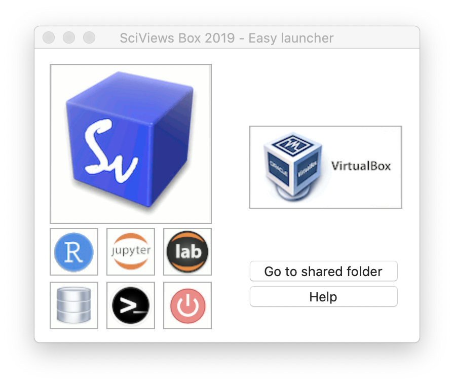
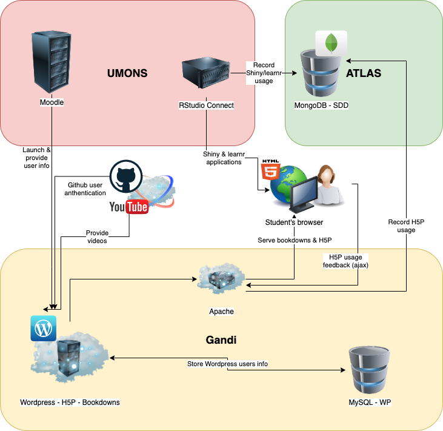

# Organisation générale {#general}

```{r setup, include=FALSE, echo=FALSE, message=FALSE, results='hide'}
knitr::opts_chunk$set(comment = '#', fig.align = "center")
#SciViews::R
```

Les divers outils logiciels que nous utilisons pour créer un environnement d'apprentissage riche et varié pour nos étudiants se basent pour la plupart sur des solutions Open Source et sur différents serveurs.

- [R](https://www.r-project.org) est le logiciel principal de statistique, visualisation et manipulation des données que nous enseignons à nos étudiants en même temps que les concepts de statistique et science des données eux-mêmes. C'est un logiciel puissant et gratuit que l'étudiant pourra s'approprier plus tard pour faire ses analyses tout au long de sa carrière s'il le souhaite. R est préféré à Python ici car il est plus orienté statistiques et moins programmation, ce qui convient mieux à nos étudiants biologistes.

- [RStudio](https://rstudio.com/products/rstudio/) en version serveur pour nos étudiants, ou en version serveur ou desktop pour les enseignants, couplé à [R Markdown](https://rmarkdown.rstudio.com) permet d'éditer du code R et des rapports ou autres documents au format R Markdown.

- [Git](https://git-scm.com) est un système de gestion de version largement utilisé en programmation et de plus en plus utilisé en science des données. Combiné à R, RStudio et R Markdown, il offre la possibilité de travailler de manière *reproductible*. Nous enseignons git en même temps que les outils plus orientés science des données à proprement parler avec l'objectif d'amener nos étudiants à prendre des bonnes habitudes en matière de traçabilité et reproductibilité de leurs analyses. Nous avons choisi [GitHub](https://github.com) comme système d'hébergement des dépôts git sur le Net, parce qu'il est gratuit, puissant, universellement utilisé et qu'il est couplé à RStudio. L'interface git et GitHub de RStudio rend son utilisation simple, et [GitHub Desktop](https://desktop.github.com) complète l'ensemble pour effectuer des tâches non reprises dans l'interface git de RStudio. Enfin, [GitHub Classroom](https://classroom.github.com/classrooms) est une extension permettant de gérer les nombreux dépôts créés par nos étudiants dans le cadre de nos cours.

- La [SciViews Box](https://www.sciviews.org/software/svbox/) est une machine virtuelle sous [VirtualBox](https://www.virtualbox.org) totalement préconfigurée. Nous créons une SciViews Box chaque année avec tous les logiciels nécessaires aux étudiants mais pas seulement\ : il s'agit aussi d'une machine virtuelle permettant de réaliser de nombreuses analyses de façon parfaitement reproductible. Faire installer tous les logiciels nécessaires par les étudiants n'est pas possible. Plusieurs solutions s'offrent à nous pour proposer un environnement logiciel préconfiguré pour les cours\ :
    * Utiliser [RStudio cloud](https://rstudio.cloud) serait la solution la plus simple au départ car l'étudiant n'a qu'à se connecter et c'est parti. Même avec un Chromebook, il peut travailler sur sa session RStudio Cloud. Cependant, la session n'est disponible *que* pour le cours et l'étudiant doit tout installer sur son ordinateur ensuite s'il veut continuer à utiliser R, RStudio et Git/GitHub (par exemple, dans le cadre de son mémoire). Or précisément, il n'a jamais appris à installer ces outils. Cela nous parait être une barrière importante à l'adoption de ces outils logiciels au-delà du cours, même si beaucoup de (grandes) universités ont choisi cette voie.
    * Utiliser [Docker](https://www.docker.com) et [Rocker](https://github.com/rocker-org/rocker) qui est une solution de containerisation pour R et RStudio. Si ces outils fonctionnent bien en production, nous les avons trouvés moins pratiques que la machine virtuelle pour nos étudiants, surtout dans un contexte où la quasi-totalité des ordinateurs utilisés sont sous Windows ou MacOS (Docker fonctionne particulièrement bien dans un environnement Linux au départ). L'installation et la gestion de containers Dockers est simple pour un utilisateur pointu, mais nous, nous démarrons avec certains étudiants qui ont une connaissance bien moins technique de l'informatique. La moindre action d'installation ou de configuration, aussi simple soit-elle, parait démesurément complexe à leurs yeux. Il faut donc démarrer avec de l'**ultra-simple**, autrement dit, fonctionnel directement ou s'auto-installant, auto-configurant tout seul.
    * Déléguer le calcul sur le cloud à travers [Binder](https://mybinder.org). Aujourd'hui, il est très facile d'exécuter du code dans un document Jupyter ou R Markdown via ce service gratuit sur le cloud. Et c'est effectivement d'un accès ultra-simple du côté de l'utilisateur qui n'a qu'à cliquer sur un lien pour lancer l'application. Au moins un format de cours en ligne y recoure ([template par Ines Montani](https://github.com/ines/course-starter-r), voir par exemple pour un cours concret en R, [Supervised Machine Learning Case Studies in R](https://supervised-ml-course.netlify.app)). Nous l'avons testé, mais l'avons jugé à l'usage trop lent au démarrage et trop limité ensuite. De plus, comme pour RStudio Cloud, les étudiants n'ont aucun logiciel utilisable sur leur PC pour travailler ensuite. La simplicité au départ ne fait donc que repousser la difficulté ultérieurement de devoir quand même installer R, RStudio, git, etc. sur son PC.
    * Enfin, la solution de la machine virtuelle avec la SciViews Box nous permet d'offrir une série de logiciels préconfigurés en version serveur et/ou locale avec interface graphique sous [Xubuntu](https://xubuntu.org). C'est une bonne base, mais l'installation était encore un peu laborieuse lorsqu'elle devait se faire à la main dans VirtualBox (on en revient pratiquement à des difficultés similaires à Docker, par exemple). Nous avons donc conçu des logiciels annexes d'installation et de lancement de la machine virtuelle de sorte que celle-ci ne soit qu'à un clic de souris (ou presque) pour nos étudiants débutants\ ! A l'usage, cela fonctionne très bien. Nous avons un lanceur rapide par édition de SciViews Box, et ce, à la fois sous Windows et sous MacOS. L'étudiant a un logiciel réellement installé sur son PC, qu'il peut parfaitement continuer à utiliser au delà des cours eux-mêmes.



- [Moodle](https://moodle.umons.ac.be) est la plateforme d'apprentissage en ligne utilisée par notre université, l'UMONS. Si elle offre de nombreuses possibilités, il n'est pas possible d'y intégrer les outils d'apprentissage liés à R comme les learnrs et les ouvrages en ligne au format bookdown, voire encore des documents R Markdown. Nous essayons d'intégrer autant que possible nos outils dans cette plateforme, mais nous sommes obligés de recourir à d'autres solutions pour pouvoir couvrir le panel des fonctionnalités qui nous sont nécessaires.

- [Bookdown](https://bookdown.org) est un type de sortie R Markdown multi-documents qui permet d'intégrer également des calculs et graphiques de R. Nous l'utilisons comme moyen de centraliser tout notre matériel pédagogique et l'organiser en modules qui sont autant de chapitres différents du bookdown. Nous avons également développé différentes extensions pour compléter le package R {bookdown} afin d'y intégrer tout ce dont nous avons besoin (voir \@ref(bookdown)), et notamment des applications Shiny (voir \@ref(shiny)) et des widgets H5P (voir \@ref(h5p)). Toutes ces extensions sont rassemblées dans le package R {learnitdown}. Un chapitre entier y est donc consacré.

- [Shiny](https://shiny.rstudio.com) permet de créer des applications sous R avec interface graphique dans un browser web. Les possibilités sont pratiquement sans limites pour créer des applications interactives et démontrer les concepts "en live" à nos étudiants. Les applications Shiny sont intégrables dans bookdown, mais elles doivent être exécutées sur un serveur dédié. Un type particulier d'application Shiny est constitué par les [learnr](https://rstudio.github.io/learnr/index.html)s. Ces documents interactifs présentent des exercices dans R et des choix multiples aux étudiants. Ces learnrs forment la base des outils d'apprentissage à domicile et aussi des examens théoriques de nos cours.

- [H5P](https://h5p.org) propose une large variété de contenus javascript intégrables dans une page web sous forme d'iframes pour varier et rendre plus efficace l'apprentissage. Il s'agit d'un logiciel gratuit open source, mais il faut installer son propre serveur sous Moodle, Wordpress ou Drupal. Des essais ont été fait sous Moodle de l'UMONS. Cela fonctionne, mais il apparaît que les contenus H5P de Moodle ne sont *pas* intégrables dans un bookdown, en tous cas pas la version de test telle qu'elle était configurée. Nous avons donc décidé d'installer notre propre serveur [Wordpress](https://fr.wordpress.com), essentiellement pour pouvoir faire fonctionner nos contenus H5P. Ce serveur est hébergé chez [Gandi.net](https://www.gandi.net/fr) qui gère aussi le nom de domaine `sciviews.org` sous lequel nos créations sont servies sur le net, ainsi que les boites mails correspondantes, comme `sdd@sciviews.org`.

- Les vidéos relatives au cours sont hébergées sur [Youtube](https://www.youtube.com/channel/UCT5UQDG5bP9YtSgBpvoRdPg) dans un canal dédié **BioDataScience-Course**. La section relative aux vidéos (voir \@ref(videos)) explique aussi en détails comment nous créons ces vidéos et avec quels outils.

- Enfin, les données relatives à la progression des étudiants dans les learnrs sont collectées dans deux bases de données MongoDB hébergée sur le cloud [MongoDB Atlas](https://account.mongodb.com) pour celle qui est publiques et dans le même serveur que RStudio Connect pour la version qui collecte au final toutes les données. La progression peut être suivie grâce aux rapports de progression (\@ref(progression)) créés dans RStudio Connect à partir de cette dernière base de données.

```{block2, type="info"}
Ces nombreux outils et services devant collaborer entre eux pour fournir un environnement d'apprentissage complet et cohérent, il est important de les configurer et de les inter-connecter correctement. C'est le but principal du présent document que de documenter ces opérations d'administration de l'écosystème logiciel utilisé.
```



Les sections suivantes détaillent l'installation et la configuration de différents outils logiciels tandis que les paragraphes suivants dans la présente section reprennent quelques informations générales utiles.

## RGPD et droit d'auteur

Les questions relatives aux données d'un point de vue plus légal sont traitées ici.

### RGPD

Le **Règlement Général sur la Protection des Données** ou RGPD (n° 2016/679) adopté par l'Union Européenne en 2016 régit la façon dont les données à caractère personnel peuvent être collectées et utilisées. Ce règlement est en faveur de l'utilisateur (ici l'étudiant). Il faut notamment son accord pour collecter et utiliser ses données personnelles. Or de telles données sont indispensables pour suivre la progression des étudiants, pouvoir les noter, etc.

A l'UMONS, l'étudiant signe le document adéquat lors de son inscription ([charte de la vie privée](https://web.umons.ac.be/fr/mentions-legales-et-protection-de-la-vie-privee/charte-vie-privee-umons-20190605/), complétée de documents disponibles sur l'Intranet UMONS). Ce document mets **Moodle** en conformité par rapport au RGPD, mais pas les outils externes dont les notres. Nous devons donc préciser exactement ce que nous devons faire pour être en conformité RGPD. Ce travail a été réalisé avec la juriste de l'UMONS en charge de cette question, ainsi qu'avec le conseiller à la sécurité des données informatiques en aout 2020. Il en résulte un document complémentaire affiché sur notre site (entrée [Protection de la vie privée](https://wp.sciviews.org/politique-de-confidentialite/) dans le menu à gauche)qui informe et précise la façon dans les données à caractère personnel des étudiants sont utilisées. Et puisque ces données entre dans un cadre d'utilité publique et que l'usage est similaire à ce qui se fait sur Moodle, un accord supplémentaire (au delà des documents qu'il a déjà rempli à son inscription) n'est pas nécessaire de la part de l'étudiant.

L'utilisateur doit avoir la possibilité d'effacer intégralement ses données personnelles s'il le souhaite lorsqu'il efface son compte d'un site. C'est indiqué explicitement dans le RGPD. Cependant, des restrictions à ceci sont indispensables pour la bonne gestion du suivi des étudiants à l'Université. C'est pour cela que l'étudiant a du signer un accord lors de son inscription. Afin d'être en conformité avec cette directive, nous avons rajouté un bouton `Effacer mes données personnelles` dans la première page des cours bookdown. S'il clique sur ce bouton, l'utilisateur peut ensuite lire le contenu de manière anonyme et les activités learnr/Shiny ne sont **pas** enregistrées. Par contre, H5P est toujours enregistré et les données historiques antérieures sont toujours dans notre base de données (TODO: voir plus tard comment éviter cela, et en tous cas, effacer régulièrement ces données pour l'instant).

L'anonymisation des données est de mise lorsque ces données servent à une étude générale (par exemple, évolution des performances des cohortes d'étudiants avec les outils progressivement mis en place, études scientifiques, ...). Cela passe par l'effacement des données de toute information à caractère personnel. Le nom, numéro de matricule ou adresse email de l'étudiant sont remplacés par un identifiant générique, par exemple, "étudiant 1", "étudiant 2", etc. Nous mettons cette pratique en œuvre pour toutes les études rétrospectives générales visant à estimer l'impact pédagogique des outils mis en place (voir appendice \@ref(anonymisation)).

##### Lien utiles {-}

- [RGPD pour les développeurs](https://lincnil.github.io/Guide-RGPD-du-developpeur/) par la [CNIL](https://www.cnil.fr/professionnel) en France,

- [Techniques d'anonymisation](https://www.cnil.fr/fr/le-g29-publie-un-avis-sur-les-techniques-danonymisation)

- [Recommandation relative aux mots de passe](https://www.legifrance.gouv.fr/cnil/id/CNILTEXT000033929210/)

- [Présentation de l'information RGPD aux utilisateurs](https://design.cnil.fr/concepts/information/)

### Droit d'auteur et licence

...TODO: discuter le choix de la licence pour notre contenu en ligne.

**TODO: réfléchir à des façons plus pratiques de mettre en œuvre l'anti-plagiat dans nos cours de Science des données.**
