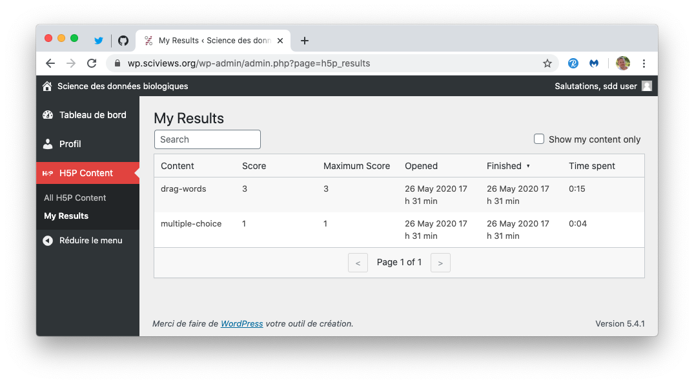

# Wordpress {#wordpress}

```{r setup, include=FALSE, echo=FALSE, message=FALSE, results='hide'}
knitr::opts_chunk$set(comment = '#', fig.align = "center")
#SciViews::R
```

Nous utilisons [Wordpress](https://wordpress.org) principalement pour gérer nos contenus **H5P**. Cependant, étant basé sur un serveur LAMP (Linux-Apache-MySQL-PHP), il permet également d'implémenter des fonctions basées sur des scripts côté serveur qui seraient difficiles, voire impossibles avec un site statique tel que l'offre {bookdown}, par exemple. Ainsi, nous pouvons aussi y intégrer un enregistrement de l'utilisateur via GitHub (protocole OAuth2). Ceci est bien pratique pour faire le lien entre le compte UMONS/Moodle et le compte Github de l'étudiant.

```{block2, type="note"}
Nous avons choisi de privilégier l'authentification GitHub à celle de l'UMONS pour les raisons suivantes\ :

- Certains étudiants arrivent au cours sans être encore complètement inscrits, avec leur propre PC portable. Ils n'ont pas encore de login UMONS et ne pourraient rien faire si on dépendait exclusivement de ce login pour travailler. Avec Github, ils créent leur compte librement et sont immédiatement opérationnels.
- Nos outils sont prêts et utilisables en dehors du contexte de l'UMONS également (si nécessaire, par exemple, pour une formation dans le cadre d'un workshop international).
- Comme GitHub et GitHub Classroom occupent une place importante dans les outils d'apprentissage de nos cours, les étudiants doivent de toute façon créer et utiliser un compte GitHub. L'authentification via GitHub permet d'être certain que ce compte est créé et fonctionnel et que l'étudiant fournit effectivement son propre login.

Toutes ces raisons sont suffisantes pour que l'authentification GitHub soit considérées comme l'élément clé dans le contexte de nos cours de Science des Données. Ainsi pour éviter de multiplier les logins, l'identifiant Wordpress de l'étudiant sera toujours identique à son login GitHub avec cette approche.

```

En 2018-2019 et 2019-2020, nous avons travaillé uniquement avec un serveur statique {bookdown} hébergé sur GitHub. Si le résultat est correct, nous avons noté plusieurs problèmes\ :

- Pas d'enregistrement des étudiants (suivi de progression impossible),
- Pas de H5P. Nous pourrions utiliser https://h5p.org, mais cette plateforme n'est prévue que pour des tests, et ne permet pas de récupérer les activités des étudiants,
- Pas de service d'applis Shiny et de learnrs. Nous exécutons ces applis en local dans la SciViews Box via les packages R [BioDataScience](https://github.com/BioDataScience-Course/BioDataScience) et [BioDataScience2](https://github.com/BioDataScience-Course/BioDataScience2). Cela permet d'utiliser les learnrs, mais sans être vraiment très pratique pour les étudiants. Les learnrs qui y sont intégrés se connectent à la base de données MongoDB via une petite appli Shiny intégrée qui demande de rentrer manuellement dans des zones de texte son login GiHhub et son email pour s'identifier. Toutefois, comme aucun contrôle n'est fait sur ce que les étudiants entrent dans ces champs, nous avons eu beaucoup d'enregistrements fantaisistes qu'il a fallu régler grâce à une table de corrections appliquée aux données de la base.

Au final, même si l'approche bookdown statique sur Github + learnr/Shiny en local dans la SciViews Box permet d'obtenir le minimum de fonctions requises pour le suivi de la progression d'apprentissage des étudiants, ce n'est pas pratique à l'usage et nous avons dû dépanner souvent des étudiants... sans compter leur stress de savoir si leur activité est bien enregistrée dans la base de données ou non (dans nos cours à l'UMONS, deux points sur vingt dans la note totale sont réservés à l'exécution de ces learnrs, d'où l'importance de bien enregistrer qui fait quoi).

## Authentification des étudiants

En 2020-2021, nous avons décidé de mettre en œuvre un serveur Wordpress pour fournir le contenu H5P qui nous manque et dont l'utilisation est enregistrée pour chaque étudiant afin de pouvoir suivre sa progression (protocole xAPI). Ce serveur Wordpress nous donne aussi l'occasion de mettre en œuvre une authentification des étudiants plus fiable. Notre objectif est double au niveau de l'authentification de nos étudiants. D'une part, nous voulons obtenir de manière fiable à la fois leurs données UMONS (via Moodle) et leur login GitHub, ce qui implique que ces données doivent être soit fournies automatiquement, soit vérifiées durant l'authentification. D'autre part, nous voulons pouvoir exécuter des applications Shiny en mode sécurisé pour, par exemple, leur offrir un rapport de progression calculé en direct. La nouvelle authentification se fait comme suit\ :

1. Nous intégrons nos outils dans Moodle via une URL qui transmet des informations relatives à l'utilisateur authentifié UMONS ("query string", c'est-à-dire la partie "?..." de l'URL). On obtient de cette façon, entre autres, son numéro de matricule, son adresse email UMONS, son nom et son prénom, le cours qu'il suit, ... Les détails sont dans la section correspondante (voir \@ref(moodle)) et ne seront donc pas discutés ici.

2. Par ailleurs, nous utilisons abondamment GitHub pour les exercices des étudiants. Leur login y est différent, et il est aussi possible qu'ils y aient indiqué une adresse email différente (même si nous leurs demandons de mettre la même, ce qui est d'ailleurs indispensable pour l'identification correcte de l'auteur des commits). Dans Wordpress, nous pouvons intégrer une authentification sur base de leur compte GitHub via le protocole OAuth2 au travers d'une application qui fait le pont entre Wordpress et GitHub, nommé **BioDataScience**.


C'est doublement intéressant car nous obtenons ainsi leur login GitHub à tous les coups, et aussi, nous sommes certains que leur compte GitHub est créé et actif dès le moment où ils sont enregistrés dans Wordpress. Que des avantages, donc. De plus, dans l'implémentation choisie, la connexion via GitHub montre clairement à l'étudiant s'il est connecté ou non.


Afin d'éviter que n'importe qui ayant un compte GitHub ne s'enregistre dans Wordpress, nos étudiants doivent s'enregistrer au préalable (TODO: formulaire d'enregistrement à ajouter dans la page "bien débuter..."). Ce formulaire crée un tableau CSV qui rassemble les données issues de Moodle et le login gitHub que l'étudiant entre après avoir vréé son compte. Ce tableau CSV doit être vérifié par l'enseignant et ensuite, il ajoute les comtes à Wordpress via le plugin **Import users from CSV** qui est installé dans Wordpress. Une fois enregistré, l'étudiant reçoit un mail et la page "bien débuter..." l'indique explicitement.

Dès que l'étudiant s'est enregistré, les données utiles venant de Github sont rentrées dans la table des utilisateurs Wordpress. Nous pouvons donc combiner cette information avec les données provenant de Moodle pour établir un profil complet de l'étudiant dans notre site Wordpress automatiquement. A noter que Wordpress tente de récupérer aussi d'autres informations venant de GitHub, dont l'email. Cependant, ce dernier peut être caché dans le compte GitHub (c'est d'ailleurs le cas par défaut), et n'est donc pas accessible. La plupart du temps, nous n'avons donc que l'email UMONS à disposition. **Nous avons donc décidé d'utiliser l'email Wordpress, l'email UMONS, ou le login Github de manière interchangeable selon le contexte comme identifiant**, mais seule la présence du login est vérifiée pour activer l'enregistrement de l'activité dans H5P/learnr/Shiny. Comme l'email git est mis à celui de l'UMONS lorsque RStudio Serveur est accédé via Moodle, l'étudiant se doit d'indiquer le *même* email dans son compte GitHub, sans quoi, ses commits à partir de la SciViews Box ne pourront pas lui être attribués dans GitHub. *C'est de sa responsabilité et actuellement, nous n'avons aucune visibilité sur l'email utilisé sous GitHub par l'étudiant dans l'implémentation mise en place^[Pour les enseignants, lors des premiers commits réalisés par vos étudiants, veuillez vérifier s'ils sont clairement identifiables. Sinon, faites corriger l'information dans la SciViews Box (identifiant git et email renseignés en haut à droite dans la boite de dialogue de configuration de la SciViews Box).].*

```{block2, type='warning'}
Le changement automatique d'email git dans la SciViews Box (à partir de la version 2020) ne se fait *que* si RStudio est accédé depuis le lien dans Moodle UMONS. Ainsi, un externe peut très bien utiliser n'importe quelle autre adresse mail sans problèmes.

L'adresse mail utilisée est celle renseignée par Moodle, soit `prénom.nom@[student.]umons.ac.be`. Cependant, dans de rares cas, l'adresse UMONS utilise des caractères qui posent problèmes ailleurs (GitHub en particulier), comme une apostrophe dans le nom. Dans ce cas, il faut basculer  sur l'adresse alternative `matricule@umons.ac.be`.

```

**TODO:** Utiliser un autre plugin OAuth2 et implémenter l'ajout de l'email lorsqu'un nouveau compte est créé depuis Github.

## Installation Wordpress

Notre nom de domaine `sciviews.org` est géré par https://gandi.net. Ce fournisseur propose aussi un hébergement web Wordpress dans un serveur LAMP préconfiguré. Nous utilisons cette option. Le serveur utilise 1 cpu et 256Mo de RAM avec 20Go d'espace de stockage, et un quota de 300.000 pages vues par mois et 60Go par mois. Il peut être augmenté à tous niveaux à n'importe quel moment (plus de cpus ou de ram, plus de débit, et espace disque jusqu'à 1To). Cette configuration se comporte très bien en charge avec nos étudiants (> 170 par an et 75 max par classe). Nous pourrons toujours passer vers un plan supérieur si des lenteurs sont constatées. Le certificat SSL pour avoir une adresse sécurisée en `https://` est inclut dans le pack. Nous ne migrerons pas vers une instance gérée par le Wordpress de l'UMONS car le sous-traitant impose des contraintes qui ne conviennent pas à notre usage (restriction sur les plugins et pas d'utilisation d'iframe). De plus, la gestion se fait vie le Département d'informatique qui dialogue avec le sous-traitant -pas d'échange direct avec le sous-traitant-, ce qui introduit un temps de latence insupportable de parfois plusieurs semaines avant d'obtenir une modification)\ !

Le serveur est installé initialement avec **PHP 7.3** et une base de données **MySQL 5.7** ne permettant que des requêtes locales (impossible d'accès par l'extérieur par décision du fournisseur). En janvier 2022, PHP est passé à la version 7.4. **Wordpress** est installé initialement à la version **5.4.2**. Il a évalué progressivement vers la version **5.8.2** en fr_BE en janvier 2022 qui est la dernière version en date et qui recommande PHP 7.4 minimum et MySQL 5.7. Donc, on est bon. Le site utilise 4Go sur les 20Go disponibles.

Le site est servi à l'adresse https://wp.sciviews.org. Les enseignants y sont enregistrés comme éditeurs. En outre, un compte administrateur est aussi créé. Le serveur est accessible par SSH (après activation provisoire de la console dans Gandi), sFTP et git/SSH. Toutes les informations nécessaires à la gestion de l'hébergement sont transmises aux intéressés par voie sécurisée.

### Plugins Wordpress

Nous avons installé les extensions suivantes (les versions correspondent à la configuration de Wordpress au 05/01/2022 et sont toutes à jour à cette date)\ :

- **[H5P](https://fr.wordpress.org/plugins/h5p/) 1.15.3**. Il faut installer les libraires séparément et les principales ont été rajoutées dès le départ. Les 5 ou 6 widgets H5P que nous avions déjà créés sont facilement importés en les exportant de leur site original au format `.h5p` en cliquant sur le bouton `Reuse` en bas à gauche du widget. Ensuite dans Wordpress, on va dans le tableau de bord -> H5P Content, on clique `Add New` puis `Téléverser` et on sélectionne le ficher `.h5p`. Une sauvegarde de ces fichiers `.h5p` est également effectué sur p-Cloud dans le dossier `sdd_h5p_backup`. Le plugin est ensuite configuré pour ne pas montrer la bannière H5P en bas des widgets et pour générer tous les événements xAPI possibles (voir \@ref(h5p)).

- **[SNORDIAN's H5PxAPIkatchu](https://fr.wordpress.org/plugins/h5pxapikatchu/) 0.4.11** capture les évènements xAPI générés par H5P et les stocke directement dans la base de données MySQL liée à Wordpress. Il y a une interface simpliste pour visualiser les tables, les filtrer et les exporter au format CSV. Nous avons patché cette version pour y rajouter l'enregistrement des évènements xAPI directement dans notre base de données MongoDB Atlas, et n'utiliser l'enregistrement local original que comme solution d'appoint au cas où l'enregistrement en MongoDB s'avère impossible pour une raison ou une autre (base saturée, indisponible, erreur, ou port 27017 de MongoDB bloqué). **Attention\ : depuis la version 0.4.7, il faut activer l'option "Embed support", sinon, les exercices H5P des pages bookdown ne sont pas enregistrées à partir de certains navigateur Web (testés avec la version 0.4.11\ : Safari et Chrome sous MacOS Big Sur, Edge et Chrome sous Windows 10 et Chromium et Firefox sous Ubuntu 20.04LTS).**

- **[OAuth Single Sign On](https://fr.wordpress.org/plugins/miniorange-login-with-eve-online-google-facebook/) - SSO (OAuth Client) 6.21.6** configuré pour enregistrer et connecter un utilisateur via son compte Github. Pour permettre ceci une application Github nommée **BioDataScience** a été créée sur Github. La configuration de ce plugin est disponible depuis le tableau de bord de Wordpress -> miniOrange -> OAuth.

- **[Import and export users and customers 1.19.1.2](https://fr.wordpress.org/plugins/import-users-from-csv-with-meta/)** permet d'exporter un tableau contenant tous les utilisateurs enregistrés dans Wordpress, accompagné des métadonnées. Ce tableau CSV est ensuite lu par la fonction `sdd_users()` pour créer les informations utilisateurs accessibles par RStudio Connect et les learnrs/apps Shiny exécutées directement dans la SciViews Box. Sa fonction d'importation des données permet de mettre à jour rapidement des données et métadonnées relatives à un grand nombre d'étudiants en une seule fois à partir d'un tableau CSV.

- **[Advanced iFrame](https://fr.wordpress.org/plugins/advanced-iframe/) Pro 2021.9** permet d'insérer un iframe avec plein d'options\ : sécurisation, adaptation de la taille, passage de paramètres, réécriture d'URL, etc. Nous utilisons ce plugin pour intégrer les bookdowns dans le site Wordpress, et ainsi conserver la bannière supérieure de notre site tout en affichant le bookdown. La version standard est installée depuis le site plugins Wordpress, et puis nous avons payé $19 pour obtenir la version PRO qui propose des fonctionnalités en plus dont nous avons besoin pendant 6 mois (renouvellement de 6 mois = $10). Pour la mise-à-jour, on télécharge la nouvelle version sous forme de fichier zippé depuis Evanto, on supprime l'ancienne version (config conservée), et on installe la nouvelle version en téléversant le fichier .zip. La configuration est telle qu'elle correspond au code suivant (qui peut être utilisé tel quel sans modifier par ailleurs quoi que ce soit dans les boites de dialogue)\ :

```
[advanced_iframe use_shortcode_attributes_only="true"
src="//www.tinywebgallery.com/blog/advanced-iframe"
width="100%" height="600" add_iframe_url_as_param="same"
show_iframe_loader="true" enable_responsive_iframe="true"
hide_elements=".tg-site-footer-bar,.entry-footer" additional_height="100"
multi_domain_enabled="false" use_post_message="false"]
```

- **[My Custom Functions](https://fr.wordpress.org/plugins/my-custom-functions/) 4.51** permet de rajouter des fonctions PHP au site sans devoir créer de plugin Wordpress pour cela et sans "polluer" les autres fichiers (comme `functions.php` du thème). Les fonctions rajoutées créent des variables dans `localStorage` du browser web sur le client pour l'identification de l'étudiant entre bookdown, H5P et les applis Shiny/learnr, pour enregistrer les évènements H5P xAPI dans MongoDB Atlas via H5PxAPIkatchu, et pour modifier Wordpress de manière cosmétique (pas d'icône Wordpress dans la barre du haut, logo et lien BioDataScience dans la page de login).

- **[WP User Avatars](https://wordpress.org/plugins/wp-user-avatars/) 1.4.1** permet de gérer les avatars des utilisateurs. Nous l'employons pour placer les photos de chaque étudiant issues des données UMONS. Pour l'instant, nous devons vérifier chaque utilisateur manuellement et rajouter ces photos à la main... mais au moins, ce plugin permet de le faire.

- **[UpdraftPlus](https://fr.wordpress.org/plugins/updraftplus/) 1.16.69** comme système de sauvegarde de l'ensemble (fichiers Wordpress + base MySQL). Le backup se fait en local pour l'instant dans `lamp0/web/vhosts/wp.sciviews.org/htdocs/wp-content/updraft`, mais il est recopié manuellement par sFTP sur notre disque p-Cloud dans le dossier `sdd_site_backup`. **TODO:** il nous faudra à terme une solution de backup automatisé sur p-Cloud ou OneDrive UMONS.

- Quelques autres plugins ne sont pas essentiels, mais aident à gérer le site Wordpress\ : **[Broken Link Checker](https://fr.wordpress.org/plugins/broken-link-checker/) 1.11.16**, **[Health Check & Troubleshooting](https://fr.wordpress.org/plugins/health-check/) 1.4.5**, **[WP-Optimize](https://fr.wordpress.org/plugins/wp-optimize/) 3.2.1**, **[WP Rollback](https://wordpress.org/plugins/wp-rollback/) 1.7.1** & **[WordPress REST API Authentication](https://wordpress.org/plugins/wp-rest-api-authentication/) 1.6.6**.

Tous ces plugins sont distribués sur le site plugins de Wordpress, sont à jour et activement maintenus, avec un grand nombre d'utilisateurs. Nous avons évité les plugins plus "confidentiels" pour lesquels nous ne sommes pas certains de la pérennité à plus long terme. **Note/ : en janvier 2022, nous avons recherché la compatibilité PHP 8.0 de ces plugins dans la doc, mais sans les tester. Nous avons trouvé des indications de compatibilité pour tous sauf OAuth SSO, Wordpress REST API, WP Rollback, WP User Avatars & Health Check & Troubleshouting. Nous n'avons pas non plus trouvé d'indications de compatibilité pour le thème Zakra utilisé (voir ci-dessous). De plus, il faudra faire une mis-à-jour des fichiers composer pour l'extension MongoDB pour PHP\ !**

### Thème du site

Pour le thème, nous avons choisi [Zakra](https://fr.wordpress.org/themes/zakra/) version "free", à jour, activement maintenu et totalement personnalisable. En jouant sur les options uniquement, nous avons pu façonner le site de telle manière qu'il reprenne une identité et les couleurs UMONS, tout en restant le plus simple, intuitif et facile d'accès possible. En janvier 2022, la version 2.0.8 est utilisée (dernière en date).

## Configuration serveur et git

Simple hosting de Gandi.net permet d'accéder aux fichiers sur le serveur de trois façons\ :

- Par sFTP (TODO: détails)
- Par Console SSH (TODO: détails). La console n'est pas active en permanence. Il faut l'activer dans le panneau de configuration du simple hosting sur Gandi.net. Cette activation reste valable pour 2 heures seulement par sécurité.
- Via git. C'est le plus simple pour développer et synchroniser son site. C'est d'ailleurs aussi la seule façon de faire pour ajouter des dépendances à PHP via composer (et nous aurons besoin de rajouter une dépendance par rapport à MongoDB pour enregistrer les évènements H5P xAPI dans notre base de données).

#### Sécurisation du site Wordpress

- Modification du fichier `.htaccess` dans `htdocs`. Afin d'éviter des attaques de type [pingback xmlrpc](https://perishablepress.com/wordpress-xmlrpc-pingback-vulnerability/) sur le site Wordpress, il faut rajouter la ligne suivante dans le fichier `.htaccess`\ :

```
RewriteRule ^xmlrpc\.php$ "http\:\/\/0\.0\.0\.0\/" [R=301,L]
```

- Utilisation des plugins "Health Check & Troubleshooting" et "WP-Optimize" pour diagnostiquer et remédier aux problèmes potentiels. Un seul problème reste impossible à résoudre pour l'instant, il s'agit de "A plugin has prevented updates by disabling `wp_version_check()`." qui peut avoir de nombreuses origines, et dans le cas de notre site, nous n'avons pas pu détecter la cause. Même en désactivant tous les plugins et le thème, le message reste. Un autre avertissement concerne la conservation de thème inutilisés. En effet, nous conservons les thèmes par défaut de Wordpress "Twenty Twenty" et "Twenty Twenty-One" car il est conseillé de les garder, au cas où Zakra aurait des problèmes. Enfin, nous utilisons aussi "Broken Link Checker". Cet outil détecte les URL incorrectes dans la pages Wordpress uniquement (pas dans les bookdowns, donc), mais cela aide. Les "issues" étant des liens qui nécessitent une authentification, cet outil les détectent tous les quatee comme incorrects, mais nous pouvons ignorer ces avertissements également. Pour tester les liens dans les bookdowns, nous utilisons un plugin Chrome en plus.

- Nous avons aussi utilisé l'outil de sécurité et d'audit de Chrome dans les outils développeurs pour détecter les failles éventuelles et les erreurs côté client (Javascript, CSS, ...), et nous assurer que le site est sain. Globalement, il n'y a pas de failles majeures, mais certains aspects pourraient être améliorés pour avoir un site plus rapide, par exemple. Nous examinerons ces points plus tard.

#### Utilisation de git {#wordpress-git}

Il faut git et un client SSH installé (pas de problèmes pour le Mac ou Linux). Les infos pour utiliser git sont dans la page de gestion du site `wp.sciviews.org` sur Gandi.net. Dans un premier temps, l'identification se fait via un mot de passe. Voici comment cloner le dépôt git à partir d'un répertoire racine de votre choix, mais nous aurons absolument besoin que ce répertoire racine soit le même que celui où les dépôts GitHub de BioDataScience-Course sont également placés (sur le Mac, il est facile de s'y placer en tapant `cd` suivi d'une espace, et puis en allant faire un drag&drop du dossier depuis le Finder vers le terminal, puis d'exécuter cette commande).

```
# Placez-vous dans le bon dossier
#cd <dossier racine des dépôts BioDataScience-Course>
git clone git+ssh://3693753@git.sd3.gpaas.net/wp.sciviews.org.git
```

Accepter (`yes`) pour le message relatif à l'authenticité, puis rentrer le mot de passe d'administration du site. **Vérifier que les fichiers du dépôt git ont bien été rajoutés dans le dossier avant de continuer.** Avant de pouvoir effectuer un push via GitHub Desktop, il faut avoir configuré git correctement et avoir une clé SSH.

```
git config --global user.name <username>
git config --global user.email <user@email.com>
# Générer une clé SSH pour l'authentification
ssh-keygen -t rsa -b 4096 -C '<user@email.com>'
```

Une fois la clé SSH générée, copier le contenu de la clé publique `~/.ssh/id_rsa.pub` d'une part vers "SSH Keys" dans GitHub -> Settings -> SSH and GPG Keys (pour être aussi en ordre vis-à-vis de GitHub), et d'autre part, me la fournir (Philippe Grosjean) via email afin que, dans le panneau principal `Simple hosting` de Gandi.net (note\ : dans la section sécurité, cliquer sur "Ajouter une clé SSH".  Puis créer une nouvelle clé et y coller le contenu).

**Avant de travailler dans un des bookdowns du cours, toujours se mettre à jour en local en faisant un pull dans le dépôt GitHub sdd-umons-xxxx depuis RStudio, ainsi qu'un pull ou un fetch depuis GiHub Desktop sur le dépôt wp.sciviews.org créé ci-dessus** Essayez une petite modification anodine dans votre dépôt git en local, puis commit et push sur GitHub. A ce stade, ce sont les *sources* du bookdown qui sont synchronisées. Allez ensuite dans GitHub Desktop au dépôt wp.sciviews.org et faites-y également un commit, et puis un push ou fetch. A ce moment-là, les pages du bookdown sont synchronisées avec le dépôt git de Gandi.net, mais pas encore *publiées* sur le site wp.sciviews.org à ce stade\ ! Il faut **déployer** ces changements en faisant dans une fenêtre terminal\ :

```
cd <Répertoire de base qui contient le dossier wp.sciviews.org>
ssh 3693753@git.sd3.gpaas.net 'deploy wp.sciviews.org.git'
```

Le `deploy` ajoute des nouveaux fichiers et remplace les fichiers existants sur le site (à condition que le droit en écriture sur les fichiers soit OK). Par contre, il n'élimine pas de fichiers. On risque donc d'accumuler des fichiers devenus inutiles au fur et à mesure de l'édition des blogdown. Si cela ne devrait pas impacter l'affichage des pages, cela utilise inutilement de l'espace disque sur le serveur. Donc, de temps en temps, il faut procéder à un nettoyage complet avec `clean` suivi d'un redéploiement. **Note\ : n'utilisez pas encore cette commande\ ! Laissez-moi (Philippe Grosjean) la tester avant cela.**

```
ssh 3693753@git.sd3.gpaas.net 'clean wp.sciviews.org.git'
```

**Attention qu'un fichier `.gitignore` correct est indispensable ici dans le dépôt wp.sciviews.org.** Les fichiers concernés par le `.gitignore` ne seront pas effacés. Tout le reste oui (faire toujours une sauvegarde complète avant)\ !.

### Ajout de mongodb pour PHP

Le serveur sur Gandi.net n'autorise qu'une seule manière de rajouter des dépendances pour PHP\ : via git + ssh en utilisant `composer`. Et il faut créer les fichiers `composer.json` et `composer.lock` sur une machine locale avant de pouvoir faire un push sur le serveur. Cela signifie d'avoir PHP et la dépendance mongodb pour PHP installés localement. Ceci n'est pas facile, et il faut les mêmes versions que sur le serveur. Comme le PHP sous MacOS Catalina a la version 7.3 de PHP, j'ai d'abord essayé sur le Mac... sans succès car la puce de sécurité T2 du Mac empêche des modifications indispensables dans les dossiers `\usr\...` pour pouvoir compiler mongodb pour PHP. J'ai essayé aussi avec la SciViews Box 2019 (mais version PHP 7.2 trop ancienne) et une VirtualBox Ubuntu Server 20.04, mais version PHP 7.4 trop élevée. Gasp\ ! Finalement, j'ai pu le faire avec une VirtualBox Xubuntu 19.10. La procédure est détaillée ci-dessous pour mémoire (mais comme elle n'est nécessaire qu'une seule fois, il ne faut plus s'en préoccuper). Plus loin, je mets aussi la procédure utilisée sur un Xubuntu 20.04LTS pour une mise à jour de l'extension...

- Noter la version X.Y de PHP utilisée sur le serveur (ici 7.3). Il faudra la même en local.

- Aller dans MongoDB Atlas et regarder la version de MongoDB déployée (ici 4.2). Il faudra une version de l'extension mongodb qui supporte à la fois la version de PHP et celle de MongoDB qui gère notre base de données.

- Rechercher la version compatible dans le tableau relatif à PHP [ici](https://docs.mongodb.com/drivers/php/). Nous pouvons voir qu'il nous faut l'extension 1.6+ ou 1.7+, avec la librairie 1.5 ou 1.6, respectivement, et par ailleurs cette version de l'extension est bien compatible avec la version 7.3 de PHP.

- Installer un (X)Ubuntu d'un version telle qu'il propose la bonne version de PHP. La 18.04LTS utilises PHP 7.2, pas bon. La 20.04LTS utilise la version 7.4 de PHP. Au final, une 19.10 convient, et c'est la version la plus récente avant qu'Ubuntu ne passe à PHP 7.4. Une machine virtuelle préinstallée peut être téléchargée depuis [Osboxes](https://www.osboxes.org). La façon de l'installer dans VirtualBox est expliquée sur le site. Le disque virtuel initial de la machine occupe 5,89Go.

- Configurer la machine virtuelle dans VirtualBox pour avoir un dossier partagé, par exemple 'Desktop' partagé en 'MacDesktop', avec connexion automatique.

- Lancer la machine virtuelle. Login\ : "oxboxes", mot de passe\ : "oxboxes.org", mais attention, en clavier configuré QWERTY. Avec un AZERTY, il faut entrer en fait "oxboxes:org" comme mot de passe.

- Aller dans le panneau de configuration et changer le clavier (belge, ou français (Macintosh) par exemple).

- Lancer un terminal et exécuter les lignes suivantes\ :

```
# Rendre le dossier partagé VirtualBox accessible pour l'utilisateur oxboxes
sudo usermod -aG vboxsf osboxes
# Mettre la machine à jour
sudo apt update
sudo apt upgrade
sudo apt autoremove
sudo apt autoclean
sudo apt clean
# Redémarrer
sudo reboot
```

- Il se peut que la machine virtuelle rebascule en QWERTY. Vérifier et corriger à nouveau. Ensuite, installer PHP et ses dépendances nécessaires\ :

```
sudo apt install php7.3-cli php7.3-dev php-pear php-mongodb composer
```

Ensuite, nous devrions pouvoir créer les fichiers nécessaires via la commande `composer require mongodb/mongodb`, mais cela ne fonctionne pas lorsque `php-mongodb` est installé via le package Ubuntu. Nous devons le compiler nous-même avec `pecl` sur la machine^[Je suis arrivé à créer `composer.lock` via la commande `composer update` en ayant été écrire à la main un `composer.json` qui contient les lignes minimales renseignées sur la page d'aide de [Gandi.net](https://docs.gandi.net/fr/simple_hosting/langages/php.html#sommaire), mais j'aboutis à une version trop ancienne du driver, et de toutes façons, c'est un bricolage qui ne me plaît pas\ !]\ :

```
# Créer un répertoire dans le dossier partagé et s'y placer
mkdir /media/sf_MacDesktop/php-mongodb
cd /media/sf_MacDesktop/php-mongodb
# Compiler mongodb depuis les sources
sudo pecl install mongodb
# Créer composer.json et composer.lock (entre autres)
composer require mongodb/mongodb
```

Pour Xubuntu 20.04LTS et mongodb dernière version pour PHP 7.4, je fais\ :

```
sudo apt install php7.4-cli php7.4-dev php-pear php-mongodb composer
mkdir ~/Desktop/php-mongodb
cd ~/Desktop/php-mongodb
sudo pecl install mongodb # Fails because it is not indicated in php.ini
# But the compilation of the .so file did succeed
composer require mongodb/mongodb # Warnings about deprecated composer 1 ignored
```

- Copier `composer.json` et `composer.lock` ainsi obtenus à la racine du dépôt git, faire un commit, un push et un deploy (`ssh 3693753@git.sd3.gpaas.net 'deploy wp.sciviews.org.git'`). Cette fois-ci mongodb PHP 1.6 semble s'être bien installé sur le serveur lors du deploy, mais pour l'ugrade à 1.11, il m'indique que je n'ai pas mongodb-ext 1.12.0, mais 1.10.0. Ceci peut aussi être vu à la console avec\ :

```
#php --ini
php -m # mongodb must be listed
php --re mongodb | head -1
```

Cela signifie que la version max. de mongodb lib qui peut être installée avec mon PHP 7.4 est la 1.9 si je ne veux pas mettre à jour également mongodb-ext. Donc\ :

```
sudo pecl uninstall mongodb
sudo pecl install mongodb-1.10.0
composer require mongodb/mongodb ^1.9
```

Maintenant, j'ai les bons `composer.json` et `composer.lock` pour une version reconnue par MongoDB 5.0 (avec une limitation en lecture, mais ici, on n'accède que en écriture). Faire commit, push et deploy et vérifier que tout se passe bien.

- Faire un test dans Wordpress. Aller jusqu'à une contenu H5P quelconque sur le site et interagir avec lui. Aller ensuite voir si les données correspondantes ont bien été enregistrées dans notre MongoDB ATLAS, dans la collection `sdd.h5p`. Si pas, vérifier si ces mêmes données sont enregistrées dans H5PxAPIkatchu dans le tableau de bord Wordpress. Si c'est le cas, c'est un problème d'accès à la base de données MongoDB ATLAS, sinon, c'est un problème plus profond\ : est-ce que l'enregistrement xAPI est bien activé, et est-ce que les extensions bookdown nécessaires ont bien été injectées grâce à une configuration correcte de [learnitdown](https://www.sciviews.org/learnitdown/)\ ? L'option de débogage de H5PxAPIkatchu devrait s'avérer utile ici pour déterminer ce qui ne va pas, voir \@ref(h5p).

## Agencement du site

La page principale https://wp.sciviews.org sert essentiellement à configurer le site lorsqu'elle est appelée depuis Moodle (enregistrement des données de l'étudiant dans un `localStorage`) et donne les instructions principales pour bien démarrer avec le contenu pédagogique.

Cette page laisse une large place à gauche pour le login GitHub, quelques liens utiles (acceuil, contact) et liste les différents bookdown disponibles, un par cours.

Chaque bookdown est dans une sous section du site, et reprend un numéro de version correspondant au début de à l'année académique\ : `/sdd-umons-2020/`, `/sdd-umons2-2020/`, etc. pour l'année académique 2020-2021, par exemple. Une fois la page principale activée depuis le lien Moodle **Cours**, l'étudiant peut aller vers le bookdown qui correspond à son cours et tout devrait fonctionner correctement. La page principale de chaque bookdown effectue de son côté les vérifications nécessaires, affiche un court compte-rendu, et permet d'effacer les données personnelles (compatibilité RGPD) si souhaité, voir \@ref(bookdown).

Le site est complété d'une bannière supérieure dont l'aspect rappelle le site UMONS et qui propose des liens vers différents items importants dans le cadre du cours pour obtenir de l'aide (Moodle, Issues, Email, ...), et donne aussi accès à l'explication pour installer le logiciel (SciViews Box). Et c'est tout. Le but est de faire ici simple et efficace...

### Tableau de bord

Dès qu'un utilisateur s'enregistre sur le site, une barre supérieure noire apparaît avec des options supplémentaires en fonction de son rôle. Un étudiant a évidemment un nombre d'options limitées à l'édition de son profil et la consultation de sa progression H5P. Un éditeur (prof) peut aussi créer et modifier des pages. Enfin, un administrateur a accès à l'ensemble des fonctions pour personnaliser le site.

Pour tous les utilisateurs, un **tableau de bord** est accessible à partir de cette barre noire supérieure. Une fois le compte créé dans Wordpress, un étudiant a la possibilité de s'y connecter via GitHub et de modifier ses informations dans le tableau de bord, dont son adresse email. S'il le fait, cette adresse n'est alors plus la même que celle de l'UMONS. C'est pourquoi, nous conservons ces deux informations séparément\ : `email` pour l'email du site Wordpress et `iemail` pour l'email institutionnel tel que renseigné à partir de Moodle. C'est toutefois l'adresse email enregistrée dans Wordpress qui est employée pour enregistrer les activités H5P. Pour les learnr et les app Shiny, c'est le login qui fait référence et qui doit être renseigné, sinon aucun enregistrement n'est réalisé (visiteur externe). Lorsque l'activité learnr ou app Shiny ne se fait, cela est indiqué par un message explicite pour éviter qu'un étudiant oublie de se logger, et puis que son travail soit perdu. Par contre, H5xAPIkatchu enregistre l'activité H5P sous un UUID créé à la volée. Nous pouvons toujours filtrer et éliminer ces données-là plus tard.

Par ailleurs, les évènements principaux H5P (début, fin, durée et résultat à la soumission des exercices) sont également enregistrés dans Wordpress directement. Cette information peut paraître redondante avec l'enregistrement H5PxAPIkatchu, mais elle est utile car l'étudiant ou l'enseignant y a accès directement dans son tableau de bord. Il peut y lire les détails de sa progression dans l'ensemble des exercices H5P de tous les cours, s'il le souhaite (voir capture d'écran). Reste à déterminer l'occupation disque de cette fonction afin de décider si nous la conservons activée sur le long terme\ !



Comme nous pouvons le voir, le tableau de bord de l'étudiant est réduit au minimum. En plus de la partie "H5P Content" où il peut voir et filtrer la liste des applis H5P et voir ses propres résultats H5P, il a accès à son profil où il peut modifier des données utilisées par nos outils. Il me semble que la maîtrise et la visibilité des données enregistrées le concernant font partie des contraintes RGPD pour lesquelles Wordpress assure la compatibilité.

Les enseignants sont enregistrés comme éditeurs sur le site. Dès lors, ils peuvent aussi modifier le contenu du site, et surtout, modifier et créer du contenu H5P avec des éditeurs conviviaux. Ainsi, l'ensemble des outils nécessaires pour l'édition du contenu sont regroupés dans ce tableau de bord... à l'exception des bookdowns et des applis Shiny/learnr. Ces dernières sont mise à disposition via un serveur RStudio Connect, totalement différent donc. Par contre, les bookdown doivent, eux, être intégrés dans le site. La façon de réaliser cette intégration est expliquée dans la section consacrée à bookdown (\@ref(bookdown)).

### Gestion des événements xAPI

Pour les enseignants, les évènements xAPI générés par H5P (voir \@ref(h5p)) qui n'ont pas pu être enregistrés dans la base de données MongoDB ATLAS dédiée pour une raison ou une autre sont accessibles à partir du tableau de bord de Wordpress dans la section H5PxAPIkatchu. De là, ils peuvent être exportés au format CSV, et réinjectés dans MongoDB à l'aide d'un peu de code R. **TODO:** H5PxAPIkatchu ne fournit **pas** la date et l'heure de chaque évènement via ce tableau, mais l'enregistre dans la base de données MySQL avec une précision de la seconde. Il faudra peut-être un accès directe à cette base de données pour récupérer l'information complète dans ce cas. Dans MongoDB ATLAS, cette information est enregistrée, par contre, avec une précision de la milliseconde.


## Variables contextuelles {#var-context}

Pour le bon fonctionnement de nos outils et l'enregistrement de l'activité des étudiants, nous avons besoin de définir un certain nombre de variables reprises dans le tableau ci-dessous. Toutes ces variables sont obtenues directement à la source^[En 2018-2019 et 2019-2020, nous utilisions le login GitHub et l'adresse email UMONS pour identifier les évènements learnr, mais comme les étudiants devaient rentrer ces infos manuellement, nous avons eu beaucoup de soucis avec des encodages erronés... Donc maintenant, nous récupérons ces infos de manière automatique à la source autant que possible.]. La colonne origine indique d'où nous obtenons ces informations (pour Moodle, il faut que l'étudiant ait lancé https://wp.sciviews.org depuis son compte Moodle et à partir de la page de cours correspondante).

| Variable      | Contenu                            | Origine      |
|:--------------|:-----------------------------------|:-------------|
| login         | Le login GitHub de l'étudiant      | WP via GitHub  |
| email         | Le mail renseigné dans Wordpress   | WP via GitHub si public  |
| displayname   | Nom utilisateur Wordpress(/Github)    | WP  |
| firstname     | Prénom comme indiqué dans Wordpress | WP  |
| lastname      | Nom de famille comme indiqué dans Wordpress | WP  |
| iemail        | Le mail UMONS (institutionnel) de l'étudiant        | Moddle `iemail`= Adresse de courriel  |
| iid           | Numéro de matricule de l'étudiant  | Moodle `iid` = Nom d'utilisateur |
| ifirstname     | Prénom comme indiqué dans Moodle | Moodle `ifirstname` = Prénom |
| ilastname      | Nom de famille comme indiqué dans Moodle | Moodle `ilastname` = Nom |
| institution   | Institution (ici `UMONS`)   | Moodle `institution` = Institution |
| icourse       | Nom de code Moddle du cours (ex.: `S-BIOG-006`)  | Moodle `icourse` = N° d'identification du cours |
| iurl          | URL du serveur institutionnel (Moodle)         | Moodle `iurl` = URL du serveur |
| iref          | Identifiant unique dans Moodle          | Moodle `iref` = Numéro d'identification |
| ictitle       | Titre du cours (ex. Science des Données I: visualisation)  | Moodle `ictitle` =   |
| icflag        | Indicateur pour les étudiants suivants plusieurs cours simultanément  | WP (éditeur des utilisateurs en mode admin)  |
| user_login2   | Second login GitHub pour le même utilisateur  | WP (éditeur des utilisateurs en mode admin)  |

A noter que nous croisons différentes sources (Moodle, GitHub, Wordpress), et les infos peuvent différer entre ces sources. Considérant un étudiant qui a "installé" ses outils correctement, à savoir\ :

- Son compte est créé au préalable dans Wordpress via un enregistrement approprié (voir au début de la section),
- Il a créé un compte GitHub et y a renseigné son adresse mail UMONS,
- Il a au moins une fois lancé la page https://wp.sciviews.org depuis le lien Moodle "Cours" dans la section "Ressources en ligne" de son cours,
- Dans la page qui s'ouvre, il s'est connecté dans Wordpress à partir du bouton de login via GitHub/BioDataScience.

A ce moment-là, tout sera en place pour gérer correctement son identité dans les différents matériels pédagogiques (bookdown, H5P, learnrs, apps Shiny, etc.). Le seul point sur lequel il faudra rester vigilant est l'identifiant de l'étudiant pour ses commits, pour lequel nous n'avons pas de contrôle automatique pour l'instant. Il ne lui restera plus alors qu'à installer la SciViews Box pour être pleinement opérationnel. Cela semble être un nombre important d'opérations à réaliser pour arriver à cela, mais l'étudiant est guidé de manière naturelle\ : il va dans Moodle, se connecte et sélectionne le cours dans la liste (il a déjà l'habitude). A partir de là, il clique naturellement sur "Cours", d'où la page qui l'enregistre et lui propose de créer un compte GitHub. Une fois que c'est fait, il peut cliquer sur le gros bouton bleu "GitHub/BioDataScience" pour se connecter dans le site "Science des Données Biologiques", et il sélectionne le manuel correspondant à son cours dans la liste. A ce stade, c'est fait. Il est enregistré^[Il est conseillé aux enseignants de tester la procédure auparavant pour vérifier qu'ils en maîtrisent bien la logique.]\ !

```{block2, type="note"}
Faut-il *forcer* le login de l'étudiant dans Wordpress\ ? Autrement dit, il n'aurait accès aux cours que s'il est connecté. Il existe des plugins Wordpress qui permettent de faire cela, et aussi d'exclure les pages qui peuvent être vues par tous. Un de ces plugins est **[Force login](https://wordpress.org/plugins/wp-force-login/)**. Nous verrons à l'usage...
```

Toutes les informations de son compte sont accessibles à l'étudiant dans Wordpress, et il peut librement les modifier dans le tableau de bord, sauf son `login`. Donc, cela signifie que l'information cruciale pour identifier un étudiant est `login` qui est par ailleurs toujours le même que le login GitHub, et `iemail`, son adresse email de l'UMONS fournie par Moodle. Nous avons éventuellement besoin aussi de `email`, son email Wordpress sous lequel les activités H5P sont enregistrées.

Si nous continuons à utiliser Discord, ce serait bien d'avoir le login Discord de l'étudiant aussi. Mais ici, il a le droit d'y poser des questions de manière anonymisée (c'est notre souhait). Néanmoins, il serait utile d'avoir un champ où nous pouvons éventuellement rentrer cette info à la main si souhaité dans la liste des utilisateurs enregistrés dans Wordpress (TODO: vérifier si c'est possible). Une autre colonne `comment` serait aussi utile. Nous pourrions y indiquer par exemple si un étudiant a des difficultés particulières, ou la date de son arrivée pour les étudiants étrangers en passerelle, par exemple.

## Redirection d'URL d'iframe bookdown

Les contenus de type {bookdown} forment l'essentiel de l'information contenue dans le site. Cependant, ces pages sont générées indépendamment des pages Wordpress. Elles sont servies à partir du même domaine, mais pas réellement intégrées dans le site Wordpress. Pourtant, visuellement, elles apparaissent comme faisant partie intégrante du site. Leur intégration se fait via un iframe géré par le plugin "Advanced Iframe Pro" qui fait des merveilles pour cette intégration.

Une conséquence visible de cette organisation est l'URL qui présente de manière explicite le fait que la page bookdown est contenue dans un iframe. Par exemple pour https://wp.sciviews.org/sdd-umons-2020/nuage-de-points.html en présentation directe hors iframe, la même page est intégrée au site Wordpress à l'intérieur d'un iframe à l'adresse URL suivante\ : https://wp.sciviews.org/sdd-umons/?iframe=wp.sciviews.org/sdd-umons-2020/nuage-de-points.html. Jusqu'ici tout va bien. L'adresse est un peu longue, mais ce n'est pas tellement grave en pratique.

Tout fonctionne bien, à part une petite subtilité concernant les **ancres**. Une ancre est un signet placé dans une page et qui permet de l'afficher à partir de cet endroit au lieu d'afficher juste le haut de la page. Par exemple, la page `nuage-de-points.html` ci-dessus peut être affichée à partir du point "2.1.1 Echelles de graphiques" correspondant à l'ancre `echelles-de-graphiques` à l'aide de l'URL suivante\ : https://wp.sciviews.org/sdd-umons-2020/nuage-de-points.html#echelles-de-graphiques. Mais si nous rajoutons `#echelles-de-graphiques` à la fin de l'URL avec iframe, il ne se passe rien. La page s'affiche au début, et non pas au point 2.1.1 comme demandé. En fait l'ancre est interprétée pour la page de base Wordpress, pas pour la page contenue dans l'iframe. Pour corriger cela, il faut **URLencoder** l'ancre, qui consiste à remplacer le `#` par son code qui est `%23`. Ainsi, si on écrit https://wp.sciviews.org/sdd-umons/?iframe=wp.sciviews.org/sdd-umons-2020/nuage-de-points.html%23echelles-de-graphiques, alors l'ancre fait maintenant partie de l'URL de l'iframe et cela fonctionne comme prévu.

Vous noterez aussi que les ancres ne sont pas rajoutées automatiquement à l'URL lorsque vous cliquez dessus dans une page {bookdown} contenue dans un iframe. **Vous devez donc effectuer le rajout à la main si nécessaire pour enregistrer correctement cette URL.** En effet, "Advanced Iframe Pro" ne gère pas encore correctement les ancres de manière automatique. Une façon simple de découvrir l'identifiant d'une ancre consiste à cliquer bouton droit dessus et à choisir "Ouvrir dans un nouvel onglet" dans le menu contextuel. A ce moment, la redirection du lien cliqué dans l'iframe s'affiche dans une page séparée *hors iframe*, avec son URL complète, y compris son ancre. Copiez cette ancre et collez-là à la fin de l'URL de la page de départ avec iframe après modification du `#` en `%23`, et le tour est joué.

A part ces petits tracas relatifs aux ancres, les pages {bookdown} dans les iframes se comportent très bien par ailleurs et permettent de combiner le meilleur des deux mondes\ : Wordpress et ses nombreuses fonctions et plugins et {bookdown} pour un contenu riche créé à partir de documents R Markddown.
