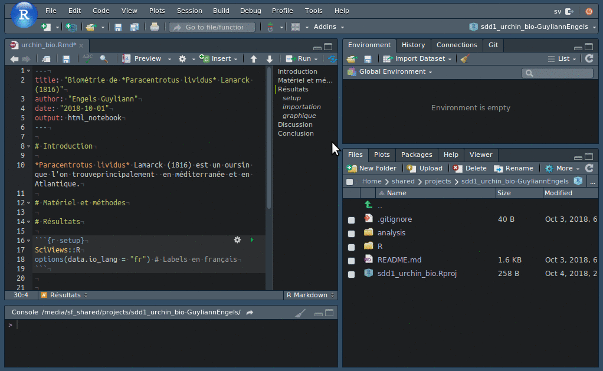

# Visualisation I {#visu1}

```{r setup, include=FALSE, echo=FALSE, message=FALSE, results='hide'}
knitr::opts_chunk$set(comment = '#', fig.align = "center")
SciViews::R
```


##### Objectifs {-}

- Découvrir --et vous émerveiller de--  ce que l'on peut faire avec le [logiciel R](http://www.r-project.org) [@R-base]

- Savoir réaliser différentes variantes d'un graphique en nuage de points dans R avec la fonction `chart()`

- Découvrir le format R Markdown [@R-rmarkdown] et la recherche reproductible

- Intégrer ensuite des graphiques dans un rapport et y décrire ce que que vous observez

- Comparer de manière critique un flux de travail "classique" en biologie utilisant Microsoft Excel et Word avec une approche utilisant R et R Markdown\ ; Prendre conscience de l'énorme potentiel de R

##### Prérequis {-}

Si ce n'est déjà fait, vous devez installer et vous familiariser avec la 'SciViews Box', RStudio, Markdown. Vous devez aussi maîtriser les bases de Git et de GitHub (avoir un compte GitHub, savoir cloner un dépôt localement, travailler avec GitHub Desktop pour faire ses "commits", "push" et "pull"). L'ensemble de ces outils a été abordé lors de la création de votre site personnel professionnel du module \@ref(intro).

<iframe src="https://h5p.org/h5p/embed/453026" width="780" height="270" frameborder="0" allowfullscreen="allowfullscreen"></iframe><script src="https://h5p.org/sites/all/modules/h5p/library/js/h5p-resizer.js" charset="UTF-8"></script>

Avant de poursuivre, vous allez devoir découvrir les premiers rudiments de R afin de pouvoir réaliser par la suite vos premiers graphiques. Pour cela, vous aurez à lire attentivement et effectuer tous les exercices de deux tutoriels^[Reportez-vous à l'Appendice \@ref(learnr) pour apprendre à utiliser ces tutoriels.].

```{block2, type='bdd'}
Démarrez la SciViews Box et RStudio. Dans la fenêtre **Console** de RStudio, entrez l'instruction suivante suivie de la touche `Entrée` pour ouvrir le tutoriel concernant les bases de R :

    BioDataScience::run("02a_base")

Ensuite, vous pouvez également parcourir le tutoriel qui vous permettra de découvrir R sur base d'une analyse concrète (cliquez dans la fenêtre **Console** de RStudio et appuyez sur la touche `ESC` pour reprendre la main dans R à la fin d'un tutoriel) :

    BioDataScience::run("02b_decouverte")

([BioDataScience](https://github.com/BioDataScience-Course/BioDataScience) est un package R spécialement développé pour ce cours et que vous avez dû installer lors de la configuration de votre SciViews Box, voir Appendice \@ref(install-tuto)).
```


## Nuage de points

Dès que vous vous sentez familiarisé avec les principes de base de R, vous allez pouvoir réaliser assez rapidement des beaux graphiques. Par exemple, si vous souhaitez représenter une variable numérique en fonction d'une autre variable numérique, vous pouvez exprimer cela sous la forme d'une **formule**^[Dans R, une **formule** permet de spécifier les variables avec lesquelles on souhaite travailler, et leur rôle. Par exemple ici, la variable _x_ sur l'axe des abscisses et la variable _y_ sur l'axe des ordonnées.]

$$y \sim x$$

que l'on peut lire "y en fonction de x". Pour les deux variables numériques _x_ et _y_, la représentation graphique la plus classique est le **nuage de points** (voir Fig. \@ref(fig:first-scatterplot) pour un exemple).

```{r first-scatterplot, echo=FALSE, results='hide', message=FALSE, fig.cap="Exemple de graphique en nuage de points. Des éléments essentiels sont ici mis en évidence en couleurs (voir texte). \\label{np_intro}"}
urchin <- read("urchin_bio", package = "data.io", lang = "fr")
chart(data = urchin, height ~  weight) + 
  geom_point() +
  labs( x = "Label de l'axe x  + [Unité]", 
        y = "Label de l'axe y + [Unité]") +
  theme(axis.text.x = element_text(colour = "#a80039", size = 15), 
        axis.title.x = element_text(colour = "#029687", size = 15), 
        axis.text.y = element_text(colour = "#a80039", size = 15), 
        axis.title.y = element_text(colour = "#029687", size = 15),
        axis.line.x = element_line(colour = "#a80039"),
        axis.line.y = element_line(colour = "#a80039")
  )
```

Les éléments indispensables à la compréhension d'un graphique en nuage de points sont mis en évidence à la Fig. \@ref(fig:first-scatterplot) : 

- Les axes avec les graduations (en rouge),
- les labels et les unités des axes (en bleu).

Les instructions dans R pour produire un tel nuage de point sont :

```{r, fig.cap="Taille (hauteur du test) d'oursins en fonction de leur masse."}
# Chargement de SciViews::R
SciViews::R
# Importation du jeu de données
urchin <- read("urchin_bio", package = "data.io", lang = "fr")
```


```{r, eval=(knitr::opts_knit$get('rmarkdown.pandoc.to') == 'html'), message=FALSE, warning=FALSE}
# This does not work???
#DT::datatable(urchin , filter = 'top', class = c('compact', 'cell-border'), 
#              rownames = FALSE, options = list(pageLength = 5, scrollX = TRUE),
#              caption = "Jeu de données sur la biométrie des oursins")
```

```{r, echo = FALSE, eval=(knitr::opts_knit$get('rmarkdown.pandoc.to') == 'latex')}
urchin
```

```{r}
# Réalisation du graphique 
chart(data = urchin, height ~ weight) +
  geom_point()
```

La fonction `chart()` n'est pas accessible dans R de base, mais l'extension chargée via l'instruction `SciViews::R` rend cette fonction disponible. Elle requiert comme argument le jeu de donnée (`data = urchin`, c'est un objet `dataframe` ou `tibble` dans le langage de R), ainsi que la formule à employer dans laquelle vous avez indiqué le nom des variables que vous voulez sur l'axe des ordonnées à gauche et des abscisses à droite de la formule, les deux membres étant séparés par un "tilde" (`~`). Vous voyez que le jeu de données contient beaucoup de variables (les titres des colonnes du tableau en sortie). Parmi toutes ces variables, nous avons choisi ici de représenter `height` en fonction de `weight`, la hauteur en fonction de la masse des oursins. Jusqu'ici, nous avons spécifié _ce que_ nous voulons représenter, mais pas encore _comment_ (sous quelle apparence), nous voulons les matérialiser sur le graphique. Pour un nuage de points, nous voulons les représenter sous forme de ... points ! Donc, nous devons ajouter la fonction `geom_point()` pour indiquer cela.

### Le nuage de points en vidéo

Vous trouverez une vidéo ci-dessous vous expliquant la création du nuage de points dans R sur ce jeu de données, en analysant d'autres variables.

<iframe src="https://h5p.org/h5p/embed/453064" width="780" height="270" frameborder="0" allowfullscreen="allowfullscreen"></iframe><script src="https://h5p.org/sites/all/modules/h5p/library/js/h5p-resizer.js" charset="UTF-8"></script>

```{r,echo = FALSE,eval=(knitr::opts_knit$get('rmarkdown.pandoc.to') == 'latex')}
cat("Retrouvez la vidéo via le lien suivant : https://www.youtube.com/watch?v=-QzG3Xr202w")
```

Cette vidéo ne vous a montré que les principaux outils disponibles lors de la réalisation de graphiques. Soyez curieux et expérimentez par vous-même ! 

##### A vous de jouer {-}

```{block2, type='bdd'}
Dans la fenêtre **Console** de RStudio, entrez l'instruction suivante suivie de la touche `Entrée` pour ouvrir le tutoriel concernant le nuage de points :
    BioDataScience::run("02c_nuage_de_points")
N'oubliez pas d'appuyer sur la touche `ESC` pour reprendre la main dans R à la fin d'un tutoriel)
```

### Echelles d'un graphiques

Vous devez être vigilant lors de la réalisation d'un nuage de point particulièrement sur l'étendue des valeurs présentées sur vos axes. Vous devez utilisez votre expertise de biologiste pour vous posez les deux questions suivantes :

- Est ce que l'axe représente des valeurs plausibles de hauteurs et de masses de ces oursins appartenant à l'espèce *Paracentrotus lividus* ?

- Quels est la précision des mesures effectuées ?

Dans certains cas, la forme du nuage de points peut être distendu par la présence de valeurs aberrantes. Ce n'est pas le cas ici, mais nous pouvons le simuler en distendant artificiellement soit l'axe X, soit l'axe Y, soit les deux :

```{r, echo=FALSE, fig.cap="Piège du nuage de points. A) graphique initial montrant la variation de la hauteur [mm] en fonction de la masse [g]. B) graphique A avec la modification de l'échelle de l'axe X. C) Graphique A avec une seconde modification de l'axe X. D) Graphique A avec modification simultanée des deux axes."}
a <- chart(data = urchin, height ~  weight) + 
  geom_point() +
  theme(text = element_text(size = 10)) # Réduction des labels
# Modification des échelles
b <- a + scale_x_continuous(limits = c(0, 500))
c <- a + scale_x_continuous(limits = c(-100, 120))
d <- a + scale_x_continuous(limits = c(-400, 400)) +
         scale_y_continuous(limits = c(-400, 400))
# Assemblage des graphiques
combine_charts(list(a, b, c, d))
```


```{r,echo = FALSE,eval=(knitr::opts_knit$get('rmarkdown.pandoc.to') == 'latex')}
cat("Retrouvez une séance d'exercice via une application shiny \n uniquement disponible sur la version en ligne")
```

<iframe src="https://guyliannengels.shinyapps.io/scatterplot/" width="780" height="450" frameborder="0"></iframe>

### Transformation des données

Vous avez la possibilité d'appliquer une transformation de vos données (il est même conseillé de le faire) afin qu'elles soient plus facilement analysables. Par exemple, il est possible d'utiliser des fonctions de puissance, racines, logarithmes, exponentielles^[Pour les proportions (`prop`) ou les pourcentages (`perc`) (valeurs bornées entre 0 et 1 ou 0 et 100%) la transformation arc-sinus est souvent utilisée : $prop′ = \arcsin \sqrt{prop}$ ou $perc′ = \arcsin \sqrt{perc / 100}$.] pour modifier l'apparence du nuage de points dans le but de le rendre plus linéaire (car il est plus facile d'analyser statistiquement des données qui s'alignent le long d'une droite). Par exemple, sur nos données de hauteurs et masses d'oursins, la transformation double-logarithmique (log(x) *et* log(Y)) fonctionne très bien pour rendre le nuage de points plus linéaire :

```{r, fig.cap = "A) Hauteur [mm] en fonction de la masse [g] d'oursins violets. B) Logarithme en base 10 de la hauteur [mm] en fonction du logarithme en base 10 de la masse [g] de ces mêmes oursins."}
# Réalisation du graphique de la hauteur en fonction de la masse
a <- chart(urchin, height ~  weight) + 
  geom_point()
# Application du logarithme sur les deux variables représentées
b <- chart(urchin, log10(height) ~  log10(weight)) + 
  geom_point() +
  labs(x = "log(Masse totale [g])", y = "log(Hauteur du test [mm])")
# Assemblage des graphiques
combine_charts(list(a, b))
```

##### Pièges et astuces {-}

RStudio permet de récupérer rapidement des instructions à partir d'une banque de solutions toutes prêtes. Cela s'appelle des **snippets**. Vous avez une série de snippets disponibles dans la SciViews Box. Celui qui vous permet de réaliser un graphique en nuage de points s'appelle `.cbxy` (pour **c**hart -> **b**ivariate -> **xy**-plot). Entrez ce code et appuyez ensuite sur la tabulation dans un script R, et vous verrez le code remplacé par ceci dans la fenêtre d'édition :

```
chart(data = DF, YNUM ~ XNUM) +
  geom_point()
```

Vous avez à votre disposition un ensemble de snippets que vous pouvez retrouver dans l'aide-mémoire consacré à [**SciViews**](https://github.com/BioDataScience-Course/cheatsheets/blob/master/keynote/sciviews_cheatsheet.pdf). Vous avez également à votre disposition l'aide-mémoire sur la visualisation des données ([**Data Visualization Cheat Sheet**](https://www.rstudio.com/resources/cheatsheets/)) qui utilise la fonction `ggplot()` plutôt que `chart()` et une interface légèrement différente pour spécifier les variables à utiliser pour réaliser le graphique (`aes(x = ..., y = ...)`).

##### A vous de jouer {-}

Une nouvelle tâche va vous être demandée ci-dessous en utilisant GitHub Classroom \@ref(classroom). Cette tâche est un travail **individuel**. Une fois votre assignation réalisée, faites un clone local de votre dépôt et placez-le dans le sous-dossier `projects` de votre dossier partagé avec la SciViews Box `shared`. Vous aurez alors un nouveau projet RStudio \@ref(rs-projet)

```{block2, type='bdd'}
Les instructions R que vous expérimentez dans un learnR peuvent être employées également dans un script d'analyse. Sur base du jeu de données `urchin_bio`, explorez différents graphiques en nuages de points. Utilisez l'URL suivante pour accéder à votre tâche\ :
- <https://classroom.github.com/a/eYrXLy_u>
```

```{block2, type='bdd'}

Inspirez-vous du script dans le dépôt `sdd1_iris`. Vous devez commencer par faire un "fork" du dépôt, puis un clone sur votre ordinateur en local pour pouvoir l'utiliser. 

- <https://github.com/BioDataScience-Course/sdd1_iris>

```
Prêtez une attention toute particulière à l'organisation d'un script R. En plus des instructions R, il contient aussi sous forme de commentaires, un titre , la date de la dernière mise à jour, le nom de l'auteur, et des sections qui organisent de façon claire le contenu du script. A ce sujet, vous trouverez des explications détaillées concernant l'utilisation des scripts R dans l'annexe \@ref(script).


##### Pour en savoir plus {-}

- [Visualisation des données dans R for Data Science](http://r4ds.had.co.nz/data-visualisation.html). Chapitre du livre portant sur la visualisation des données, en anglais.

- [ggplot2 nuage de point](http://www.sthda.com/french/wiki/ggplot2-nuage-de-points-guide-de-d-marrage-rapide-logiciel-r-et-visualisation-de-donn-es#nuage-de-points-simples). Tutoriel en français portant sur l'utilisation d'un nuage de points avec le package `ggplot2` et la fonction `geom_point()`.

- [Fundamentals of Data Visualization](http://serialmentor.com/dataviz/). Un livre en anglais sur les fondamentaux de la visualisation graphique.

- [R Graphics Cookbook - Chapter 5: Scatter Plots](https://rpubs.com/escott8908/RGC_Ch5_Scatter_Plots). Un chapitre d'un livre en anglais sur l'utilisation du nuage de points.

- [geom_point()](http://ggplot2.tidyverse.org/reference/geom_point.html). La fiche technique de la fonction (en anglais).


##### Testez vos acquis {-}

```{block2, type='bdd'}

Dans la fenêtre **Console** de RStudio, entrez l'instruction suivante et puis appuyez sur la touche `Entrée` pour ouvrir le tutoriel de challenge concernant le nuage de points :

    BioDataScience::run("02d_np_challenge")

N'oubliez pas de vous enregistrer (login GitHub et email UMONS) au début, et d'appuyer sur la touche `ESC` pour reprendre la main dans R à la fin d'un tutoriel.

```

## Graphiques dans R Markdown

Un fichier R Markdown est un fichier avec une extension `.Rmd`. Il permet de combiner le langage Markdown que vous avez déjà abordé au premier module avec du code R, tel que celui utilisé dans la première partie de ce module 2. 

```{r, echo = FALSE,eval=(knitr::opts_knit$get('rmarkdown.pandoc.to') == 'html')}

```


### R Markdown en vidéo

La vidéo ci-dessous vous montre ce qu'est R Markdown, un format hybride entre Markdown et R bien pratique pour inclure vos graphiques directement dans un rapport. Elle vous montre aussi comment transformer un script R en document R Markdown (ou R Notebook, qui en est une variante).

```{r,echo = FALSE,eval=(knitr::opts_knit$get('rmarkdown.pandoc.to') == 'latex')}
cat("Retrouvez une séance d'exercice lié à une vidéo \n disponible via l'url suivant : https://h5p.org/h5p/embed/369438")
```

<iframe src="https://h5p.org/h5p/embed/369438" width="780" height="270" frameborder="0" allowfullscreen="allowfullscreen"></iframe><script src="https://h5p.org/sites/all/modules/h5p/library/js/h5p-resizer.js" charset="UTF-8"></script>

Les balises spéciales R Markdown à retenir sont les suivantes :

- en entrée de chunk R : ```` ```{r} ```` seul sur une ligne. Il est aussi possible de rajouter un nom, par exemple, ```` ```{r graphique1} ```` et/ou des options, par exemple, ```` ```{r, echo=FALSE, results='hide'} ```` pour cacher et le code et le résultat dans le rapport),
- en sortie de chunk R : ```` ``` ```` seul sur une ligne.

Vous devez bien entendu avoir autant de balises d'entrée que de balises de sortie. Des explications plus détaillées se trouvent dans l'annexe \@ref(Rmd) dédiée au R Markdown. De plus, l'écriture d'un rapport d'analyse scientifique doit respecter certaines conventions. Vous trouverez des explications à ce sujet dans l'annexe \@ref(redaction-scientifique).

```{block2, type='note'}
Vous ne devez bien évidemment pas commencer avec un script R. Vous pouvez commencer d'emblée avec un R Markdown/R Notebook et écrire vos instructions R directement dedans. Il vous est toujours possible d'exécuter ces instructions ligne après ligne dans la fenêtre **Console** pour les tester tout comme à partir d'un script R.
```

##### Pour en savoir plus {-}

- [Communicating results with R Markdown](https://rviews.rstudio.com/2018/11/01/r-markdown-a-better-approach/) explique la même chose que dans la vidéo, avec plus de détails et des liens vers d'autres documents utiles (en anglais).

- [What is R Markdown?](https://rmarkdown.rstudio.com/lesson-1.html). Vidéo en anglais + site présentant les différentes possibilités, par les concepteurs de R Markdown (RStudio).

- [Introduction to R Markdown](https://rmarkdown.rstudio.com/articles_intro.html). Tutoriel en anglais, par RStudio.

- [R Markdown : the definitive guide](https://bookdown.org/yihui/rmarkdown/) est **le** manuel par excellence pour R Markdown (en anglais uniquement, malheureusement).

- Aide-mémoire R Markdown: dans les menus de RStudio : `Help -> Cheatsheets -> R Markdown Cheat Sheet`

- Référence rapide à Markdown : dans les menus RStudio `Help -> Markdown Quick Reference`

- [Introduction à R Markdown](https://rstudio-pubs-static.s3.amazonaws.com/32239_0956f02cef24443abd9525551368ef12.html#6). Présentation en français par Agrocampus Ouest - Rennes.

- [Le langage R Markdown](https://www.fun-mooc.fr/c4x/UPSUD/42001S02/asset/RMarkdown.pdf). Introduction en français concise, mais relativement complète.

- [Reproducible reports](https://rworkshop.uni.lu/lectures/lecture04_rmarkdown.html#1) with R Markdown. Une explication en anglais de la raison d'être de R Markdown.

- [Why I love R Notebooks](https://rviews.rstudio.com/2017/03/15/why-i-love-r-notebooks/) explique (en anglais) pourquoi le format R Notebook est particulièrement bien adapté à la science des données.


##### A vous de jouer {-}

- Vous allez maintenant manipuler un **R Notebook** pour construire de manière interactive une analyse en même temps que le rapport associé.

```{block2, type='bdd'}
Partez du projet `sdd1_urchin_bio` que vous avez obtenu via le lien GitHub Classroom dans la première partie de ce module. 
Votre objectif est de comprendre les données proposées, en utilisant des visualisations graphiques appropriées et en documentant le fruit de votre étude dans un rapport R Notebook. Utilisez le graphique en nuage de points que vous venez d'étudier, bien sûr, mais vous êtes aussi encouragés à expérimenter d'autres formes de visualisation graphique.
```

- Flux de travail "classique" en biologie (Microsoft Excel et Word) comparé à R et R Markdown.

Une nouvelle tâche va vous être demandée ci-dessous en utilisant GitHub Classroom \@ref(classroom). Cette tâche est un travail **en équipe**. Une fois votre assignation réalisée, faites un clone de votre dépôt et placez-le dans le dossier `shared/projects`.

```{block2, type='bdd'}
Comparez le workflow classique en biologie via Microsoft Office avec l'utilisation de R - R Markdown en suivant les explications dans le fichier `README.md`du dépôt accessible depuis\ :
- <https://classroom.github.com/g/2Cii2dws>
```
