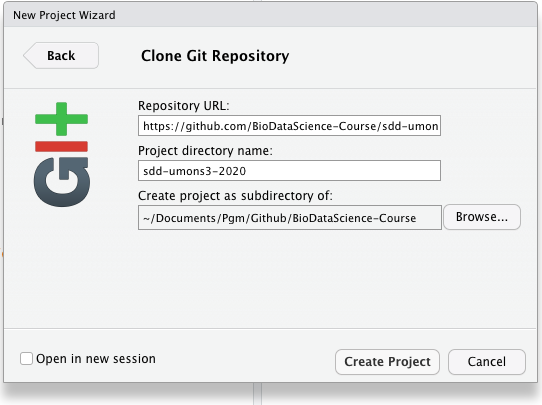
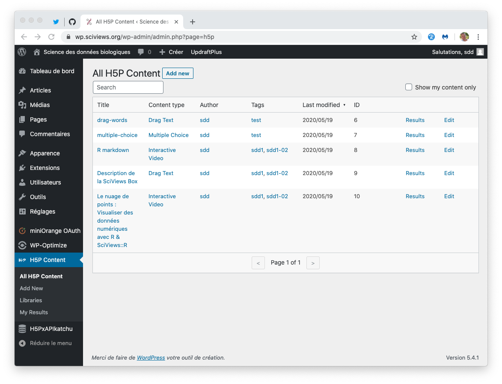

# Bookdown & learndown {#bookdown}

```{r setup, include=FALSE, echo=FALSE, message=FALSE, results='hide'}
knitr::opts_chunk$set(comment = '#', fig.align = "center")
#SciViews::R
```

Un matériel pédagogique riche et varié est un plus indéniable pour un cours. La même matière présentée de différentes façon stimule les étudiants ayant des sensibilités différentes, et permet une certaine répétition non monotone du message, une des clé d'un apprentissage réussi. Cependant, lorsque nos avons commencé à produire des vidéos, des applications learnr, des dépôts Github, des présentations sous forme de diapositives, ... les étudiants étaient un peu perdus dans la quantité de matériel disséminé en différents endroits. **Il est important de centraliser et organiser de manière logique l'ensemble du matériel pédagogique\ !** Il faut que cette centralisation propose **un file conducteur**, tout en permettant par la suite de **retrouver facilement l'information** souhaitée plus tard. La présentation sous forme de bookdown offre ces atouts\ :

- En organisant la matière par chapitres, et grâce à la table des matières présente à la gauche, l'étudiant appréhende immédiatement le fil conducteur du cours.
- La table des matières autant que l'outil de recherche dans le bookdown tout entier permet de retrouver plus tard l'information facilement^[Un autre projet nommé **do-it-yourstat** vise à proposer également un tableau de bord complètement personnalisable afin d'organiser son matériel didactique librement et d'y accéder de différentes manières, y compris par cartes mentales, par mots clés, par diagramme décisionnel, ...].

Le format bookdown est conçu principalement pour écrire des document de type "textbook" linéaires, même si au fil du temps, il permet d'intégrer des éléments plus interactifs et présentant la matière différemment comme des applications Shiny ou des vidéos. **Les extensions à bookdown proposées par le package {learndown}** complète encore les possibilités d'y inclure du matériel interactif et contextuel via H5P, les applications Shiny ou learnr qui peuvent être démarrées *in situ* à la demande, le contenu contextuel en fonction d'une institution ou d'un cours lié à l'étudiant, ou les zones de détail déroulantes. Mais toutes ces additions demandent une adaptation profonde du document bookdown. Le plus facile est donc de démarrer par un fork depuis le dépôt template [bookdown-test](https://github.com/phgrosjean/bookdown-test). La section suivante explique comment créer un nouveau site bookdown agrémenté des ajouts de {learndown} via ce fork, et explique ensuite comment l'intégrer dans un site Wordpress. Les fonctionnalités nouvelles offertes par {learndown} sont détaillées par après.

## Création d'un bookdown/learndown

Les fonctions supplémentaires relatives à H5P et Shiny/learnr proposées par {learndown}, ainsi que l'intégration à Wordpress impliquent des modifications non triviales dans les paramètres de bookdown. Le plus simple est donc de partir sur la base d'un template fonctionnel. Ce template est fourni à partir du dépôt Github [phgrosjean/bookdown-test](https://github.com/phgrosjean/bookdown-test). La procédure suivante explique comment créer un nouveau bookdown sur base de ce template. Si par contre, l'objectif est de *transformer* un bookdown existant, alors comparez les différents fichiers par rapport à ce même dépôt et modifiez-les en conséquence.

1. Naviguez vers [https://github.com/phgrosjean/bookdown-test](https://github.com/phgrosjean/bookdown-test) et cliquez sur le bouton `Use this template`.


2. Choisissez une organisation pour laquelle vous avez les droits suffisants sur Github, et indiquez un nom pour votre nouveau dépôt. Vous pouvez également ajouter une description, mettre le dépôt en privé. Il n'est pas utile d'inclure toutes les branches\ : seule la branche `master` nous intéresse. Ensuite, cliquez sur `Create repository from template`.


3. Éditez les options du nouveau dépôt (bouton `Settings` dans la page principale). Le dépôt `bookdown-test` utilisait Github-pages pour servir directement le site bookdown à partir du sous-dossier `/docs` mais ici nous serons probablement amenés à inclure les pages du site dans Wordpress. Donc, n'activez donc pas GitHub Pages pour votre nouveau dépôt.

4. Renommez le fichier `bookdown-test.Rproj` en fonction du nom de votre dépôt. Ouvrez-le dans GitHub, puis éditez-le. *Ne changez rien surtout dans le contenu*, mais modifiez sont nom au dessus de la boite d'édition et commitez directement ce changement.

5. Clonez à présent ce nouveau dépôt localement sur votre ordinateur. Vous pouvez le faire à la ligne de commande, via GitHub Desktop, ou directement via RStudio si vous utilisez ce logiciel pour éditer votre bookdown. Dans RStudio, allez dans le menu `File -> New Project...`, choisissez `Version Control` puis `Git` et placez-y l'URL de votre dépôt. Vérifier le dossier dans lequel le dépôt sera placé localement et cliquez sur `Create Project`.



6. Modifiez différents fichiers dans votre nouveau dépôt à partir de RStudio tel qu'expliqué ci-dessous... et éditez votre nouveau bookdown\ !

### README.md

Le premier fichier à modifier est `README.md`. Il doit bien entendu être complètement réécrit en fonction du contexte de votre propre bookdown. Profitez-en pour vérifier la license que vous voulez proposer pour votre oeuvre, indiquez-le dans `README.md` et adaptez éventuellement le fichier `LICENSE` en conséquence.

### _bookdown.yml

Le fichier `_bookdown.yml` contient une entrée cruciale pour l'intégration de votre bookdown à Wordpress: `output_dir`. Pour l'instant il est indiqué `output_dir: docs` ce qui signifie que le site bookdown est construit dans le sous-dossier `docs`^[Vous pouvez laisser votre bookdown à cet endroit-là et le servir à l'aide de GitHub Pages si vous voulez, mais alors l'intégration à Wordpress, y compris l'identification des utilisateurs,  et l'enregistrement des évènements H5P ne seront pas possibles.] Vous allez indiquer un chemin relatif *en dehors du dépôt* (utilisez la notation `..` pour revenir un dossier en arrière). Vous allez pointer vers le sous-dossier `htdocs/nom_bookdown` où `nom_bookdown` est le nom de votre dépôt bookdown dans Wordpress. L'endroit où cela se trouve dépend de la façon dont vous gérez les fichiers de votre site web Wordpress. Dans notre exemple, nous proposns [Gandi.net](https://www.gandi.net/) comme hébergeur car il combine nom de domaine, boites mails, certificats HTTPS renouvelés automatiquement et site Wordpress complètement préinstallé pour un coût modique. A la section \@ref(wordpress-git) nous avons déjà réalisé un dépôt git associé à notre instance Wordpress. Nous y ajoutons donc le sous-dossier `htdocs`, et allons faire pointer `output_dir` vers le bon emplacement sous forme de chemin relatif. Par exemple dans notre cas, le dépôt bookdown Github s'appelle `sdd-umons3-2020` et le dépôt git Gandi.net pour notre Wordpress s'appelle `wp.sciviews.org` et ces deux dossiers sont placés dans le même répertoire. Dans ce cas, nous indiquerons `output_dir: '../wp.sciviews.org/htdocs/sdd-umons3-2020'`.

Profitez-en pour éditer également les autres entrées dans `_bookdown.yml`\ :`book_filename`, `repo`, `clean` et les labels en fonction de la langue de votre œuvre.

Une fois que c'est fait et que le fichier `_bookdown.yml` modifié est sauvegardé sur le disque, vous pouvez effacer tout le sous-répertoire `docs` dans le dépôt GitHub de votre bookdown car vous n'en avez plus besoin.

Vérifiez que les fichiers de votre site bookdown vont se placer au bon endroit en le compilant\ : après avoir installé le package R {bookdown}, vous avez un addin `Preview Book` dans le menu déroulant `Addins` de RStudio. Sélectionnez-le et laisser le site se compiler. Ensuite, vérifiez que les fichiers correspondants ont bien été ajoutés dans le sous-dossier `htdocs/nom_bookdown` de votre dossier Wordpress (`wp.sciviews.org` dans notre exemple). Si pas, corrigez le chemin relatif dans `output_dir`.

### _output.yml

Ce fichier contient des entrées complémentaires pour paramétrer l'apparence de votre bookdown. Consultez [la documentation de bookdown](https://bookdown.org/yihui/bookdown/) pour vous y aider. Vous voudrez certainement adapter les entrées `config: toc: before:`, `config: toc: after:`, `config: edit:` et `config: view:` en fonction du contexte de votre nouveau dépôt.

### index.html

C'est le troisième fichier qui définit le contexte de votre bookdown.

- Adapter `title` et `author`.
- Modifiez `githut-repo` pour pointer vers votre dépôt Github. 
- Modifiez l'`url` comme celle de votre site Worpress mais avec comme sous dossier `nom_bookdown`. Dans l'exemple, il s'agit de `'https\://wp.sciviews.org/sdd-umons3-2020/'`.
- Tant que vous y êtes, adaptez aussi `description`, éditez le contenu de la page et éventuellement aussi, modifiez l'image `front-cover.png` pour refléter le contenu de votre ouvrage.

### header.html & header0.html

Le fichier `header.html` est généré automatiquement par {learndown} et **il ne faut donc pas l'éditer**. Si vous voulez rajouter du contenu dans l'entête, incluez-le dans le fichier `header0.html` et ce qui s'y trouve sera placé en bas de `header.html` par {learndown}. Vous pouvez effacer `header0.html` si vous ne souhaitez rien y rajouter.

### footer.html

Placez ici ce que vous désirez en bas de page. Le fichier contient (sous forme commentée), le code nécessaire pour rajouter une zone de discussion [Disqus](https://disqus.com/) en bas de chaque page. Vous pouvez laisser le fichier en l'état ou l'effacer si vous ne souhaitez rien rajouter en bas de page... ou l'éditer en fonction des besoins.

### style.css & style0.css

La même logique est d'application pour `style.css` (généré automatiquement par {learndown} et à ne pas éditer) et `style0.css` qui contient des styles CSS complémentaires. Le fichier `style0.css` présente un exemple de compléments... à éditer en fonction du contexte. Dans cet exemple le style et les couleurs sont légèrement modifiés, et des icônes sont rajoutées pour divers blocs spéciaux. Adaptez ceci à votre propre contexte.

### setup.R

Le fichier `setup.R` est utilisé par {learndown} pour configurer votre bookdown et pour redéfinir les fonctions telles que `launch_shiny()` et `h5p()`. Voyez dans le code et éditez en fonction (des messages en français sont en commentaires).

### Contenu

En outre, ce template est prévu pour être utilisé en anglais au départ, mais les entrées qu'il faut éditer ont été rajoutées explicitement dans les fichiers de configuration pour vous aider à changer de langue. A noter que les chapitres sont dénommés "modules" et sont supposés correspondre aux différents modules d'apprentissage de votre cours.

Enfin, bien entendu, vous devez modifier le contenu ainsi que les images dans le dossier `images` et ses sous-dossiers. L'image `front-cover.png` est celle affichée en début de document, et les images `block-xxxx.png` sont les icônes affichées pour les différents blocs spéciaux. Les sous-dossiers `intro`et `shinyapps` de `images` contiennent des images relatives au contenu d'exemple dans `01-introduction.Rmd` et peuvent être effacée et/ou replacées en même temps que ce contenu.

```{block2, type="warning"}
Nous vons conseillons dans un premier temps de *ne pas* modifier la page `01-Introduction.Rmd` ni les sous dossiers `images/intro` et `images/shinyapps` et de terminer la construction et l'intégration de votre site bookdown dans Wordpress. En effet, cette section contient des pages démos qui sont utiles pour tester si les différentes fonctionnalités sont opérationnelles dans votre propre configuration. Ce n'est qu'après avoir effectué ces tests en inspectant le contenu de ce chapitre d'introduction à partir de l'URL définitive que vous pouvez alors remplacer cette page par votre propre contenu.
```

## Intégration dans Wordpress

**TODO:** cette partie doit être ùise-à-jour ét complétée\ !

Pour l'instant, il y a deux versions\ :

- Les pages affichées telles quelles. Nous avons une présentation bookdown classique. Les informations de l'identité de l'étudiant sont transmise via `localStorage`, mais le bandeau supérieur du site et la barre noire supérieure de gestion Wordpress ne sont pas affichés. Le bookdown n'est pas vraiment intégré dans le site. Cette représentation est utile pour l"utilisation du bookdown dans un contexte hors cours UMONS.

- Les même page du bookdown, **mais intégrées sous forme d'iframe** dans une page de Wordpress dédiée. Nous utilisons le plugin *Advanced iFrame Pro* qui permet de contrôler la taille de l'iframe, de lui passer des paramètres et encore d'autres choses. Cela donne pas mal, et l'utilisateur conserve la barre d'outils supérieure (accès à Moodle, Discord, etc.) ainsi que la barre noire supérieure de contrôle Wordpress qui permet aussi de vérifier d'un coup d'œil que l'on est connecté, et sous quelle identité nous le sommes. S'il veut lire le contenu du bookdown sans voir la bannière haute, le lecteur peut faire coulisser la page jusque tout en bas et cette bannière viendra se cacher derrière la barre noire supérieure Wordpress (qui, elle, reste toujours visible tant que l'utilisateur est connecté au site).

## Contenu H5P dans bookdown

Nous avons déjà vu que le contenu H5P s'affiche dans un iframe dans un document principal. Il lui transmet les événements xAPI, et c'est donc ce document principal qui doit les traiter. Nous avons ici une impossibilité à le faire si nous sommes dans un cas où H5P est servi par un serveur différent que notre bookdown. En effet, les accès en "Cross-Origin Resource Sharing" ou CORS sont restreintes pour éviter des attaques de site évidentes. Ainsi un iframe issu d'un serveur différent de la page qui l'héberge ne peut communiquer librement avec la page qui le contient si elle provient d'un site différent. Or, nous avons besoin de cette communication pour transmettre les événements xAPI...

La solution que nous avons trouvée est d'ajouter le dossier qui contient nos pages statiques du bookdown à Wordpress directement. Ainsi les deux sont maintenant servis à partir de la même adresse https://wp.sciviews.org. Pour l'instant, nous copions simplement ces fichiers dans un sous-dossier `sdd-umons` dans `lamp0/web/vhosts/wp.sciviews.org/htdocs`. Ainsi, le bookdown en question est servi par Wordpress à l'adresse https://wp.sciviews.org/sdd-umons. Et à présent, la communication des xAPI H5P est possible... à condition d'ajouter le code nécessaire dans bookdown, mais cela, nous l'avons expliqué dans le chapitre consacré à H5P (\@ref(h5p)).

Il nous faut maintenant inclure facilement les contenus H5P depuis Wordpress dans nos pages bookdown. Ces contenus sont identifiés par un numéro (ID) dans Wordpress. Cet ID apparaît clairement dans la liste des contenus H5P dans le tableau de bord. Il suffit de noter le numéro ID correspondant au contenu que l'on souhaite inclure.



Nous devons créer un iframe dans la page bookdown, mais nous pouvons déléguer ce travail à une fonction R. Cette fonction est incluse dans le package `learndown` dans une forme plus complète, mais pour comprendre ce qu'elle fait, nous pouvons nous concentrer sur la version simplifiée ci-dessous\ :

```{r, eval=FALSE}
h5p <- function(id, width = 780, height = 500) {
  glue::glue("\n<iframe src=\"https://wp.sciviews.org/wp-admin/admin-ajax.php?action=h5p_embed&id={id}\" width=\"{width}\" height=\"{height}\" frameborder=\"0\" allowfullscreen=\"allowfullscreen\" class=\"h5p\"></iframe><script src=\"https://wp.sciviews.org/wp-content/plugins/h5p/h5p-php-library/js/h5p-resizer.js\" charset=\"UTF-8\"></script>\n")
}
```

La fonction construit un fragment HTML qui ajoute un iframe et un script pour gérer l'inclusion du contenu H5P dans notre bookdown. A partir d'ici, ajouter un contenu H5P est aussi simple que d'ajouter `h5p(id)` dans du code R en ligne où "id" est l'ID que nous avons noté. On peut aussi jouer sur les arguments `width=` et `height=` pour ajuster l'emplacement et la taille du contenu H5P dans la page.

Ainsi programmé notre contenu H5P se comporte comme suit\ :

- pour un utilisateur enregistré dans Wordpress, les événements xAPI sont enregistrés à son nom. Nous pouvons donc suivre la progression de nos étudiants via les contenus H5P parsemés dans le bookdown également, en plus des applis Shiny et des learnrs. De plus, l'état d'achèvement de l'exercice est aussi enregistré pour un bon nombre de contenus H5P et rétabli lorsque la page est rechargée par le même utilisateur.

- pour un utilisateur non enregistré, les contenus H5P fonctionnent normalement, mais aucun événement xAPI n'est enregistré, et l'état de complétude de l'exercice n'est pas conservé non plus. Si la page est rechargée, les contenus H5P retournent à leur état initial à chaque fois.

Ceci est un inconfort mineur pour un utilisateur anonyme et permet l'utilisation des contenus H5P de manière optimale pour nos étudiants dûment enregistrés, tout en permettant une libre utilisation par d'autres visiteurs sans polluer notre base de données.

Nous avons également tenté de passer des arguments supplémentaires via l'URL qui lance la page bookdown, et qui les tranfèrent vers l'iframe H5P, mais sans succès car apparemment Worpress réécrit l'URL et laisse tomber ces arguments supplémentaires. Mais de toutes façons, ce n'est pas important pour l'instant car nous pouvons tracer nos utilisateurs enregistrés dans Wordpress telle que c'est actuellement implémenté.
