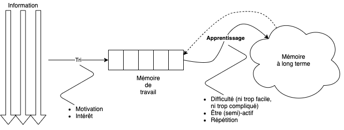

# Introduction {#intro}

Chaque section couvre un outil en particuliers, avec la section \@ref(general) qui présente la façon dont les différents outils sont assemblés pour réaliser notre environnement de travail pour les cours de **Science des Données Biologiques** à l'UMONS. La suite de cette introduction présente l'organisation générale des cours et justifie les choix technologiques qui sont détaillés dans les chapitres suivants par rapport à nos objectifs pédagogiques.

## Apprentissage

Les neuroscientifiques et les psychologues ont fait beaucoup de progrès ces derniers temps pour comprendre comment le cerveau humain apprend. Ces découvertes ont des retombées importantes au niveau de la pédagogie. Il est donc utile de s'y attarder un peu dans le but de dégager les stratégies d'apprentissage gagnantes (et celles qui sont perdantes). Ensuite sur cette base, nous pourrons mettre en place les outils pédagogiques qui optimiseront l'apprentissage de la science des données en biologie à l'UMONS.

Le schéma suivant résume comment l'apprentissage se fait dans notre cerveau.

- Nos organes des sens sont noyés en permanence dans un flux d'informations. Il est impossible de toutes les traiter avec la même attention. Ainsi, un tri est réalisé très top (presque) inconscient. Tout ce qui n'est pas conservé est bien entendu perdu. Les critères qui motivent le tri de l'information considérée comme utile sont la **motivation** et l'**intérêt**. Par exemple, donner une longue explication à des étudiants *avant* d'avoir suscité leur motivation ou leur intérêt est contre-productif, car cette information sera filtrée et éliminée très tôt sans même être traitée\ ! C'est le coup classique\ : s'arrêter en pleine explication et demander à un étudiant au hasard, ou à un étudiant manifestement peu concentré ce qu'on vient de dire... et il est incapable de répéter ce qui vient d'être dit\ ! Donc, arriver à cette situation *est en partie de la faute du professeur*. Il faut qu'il prenne soin de susciter l'intérêt et/ou la motivation *avant* de donner des explications compliquées. Cela peut-être par une phrase du genre\ : **attention, ce que je vais vous expliquer maintenant vous servira pour faire X ou Y plus tard...** ou **soyez bien attentifs, la procédure suivante est cruciale pour la réussite de l'exercice...**. Cela est également valable dans le matériel pédagogique où il faut bien préciser les objectifs en début de section (et que ces objectifs fassent écho -motivation ou intérêt- dans la tête des étudiants).

\BeginKnitrBlock{note}

Ce qui n'est pas perçu comme "utile" par l'étudiant au moment où cela est formulé est *immédiatement* oublié... C'est ce processus de tri de l'information pertinente qui en est responsable\ !

\EndKnitrBlock{note}

- Une fois le filtre du tri franchi, l'information à traiter arrive dans la mémoire de travail à court terme. Cette mémoire permet un traitement rapide l'information, **mais elle est limitée\ !** Selon les individus et/ou les circonstances, elle ne dépasse pas l'équivalent de 7-9 cases maximum. Il vaut mieux même coinsidérer **cinq cases** disponibles. Chaque case est capable d'accueillir une information à traiter. Cela signifie qu'il faut éviter d'amener trop de difficultés à la fois. si le problème est complexe et nécessite l'assimilation de nombreuses nouvelles notions, il faut alors découper le problème en plusieurs étapes plus simples. Il faut aussi faire attention qu'un certain nombre de ces cases peuvent se remplir par des éléments parasites. Par exemple, un étudiant qui doit installer un logiciel sur l'ordinateur de la salle de TP, mais se bat avec l'écran de login parce qu'il ne l'entre pas correctement, ou parce qu'il n'arrive pas à retrouver son mot de passe va concentrer son attention et une partie de son "espace de travail" à résoudre ce problème de login. Ensuite, l'espace de travail utilisé ne sera pas directement réutilisable pour la tâche désirée (installation du logiciel), et l'étudiant va se sentir débordé par les informations et en conclura qu'il est nul en informatique. Si le même étudiant avait pu se logger directement sans problèmes, il n'éprouverait peut-être pas de telles difficultés.

\BeginKnitrBlock{note}

Il faut toujours garder à l'esprit la taille très limitée de l'espace de travail dans notre cerveau, et ne jamais amener trop de notions nouvelles et/ou difficiles d'un coup. Il faut aussi apprendre à identifier les situations où les étudiants sont saturés d'information. Dans les deux cas, il faut décomposer alors le problème en étapes successives plus simples et attaquer étape par étape.

\EndKnitrBlock{note}

- Si l'information arrive dans l'espace de travail du cerveau de l'étudiant, ce n'est pas encore gagné pour autant. Il faut en effet bien évidemment qu'il soit capable de traiter le problème. S'il est dans une impasse, tout s'arrête-là\ ! **Donc, il faut adapter le niveau de difficulté aux connaissances et au potentiel de l'étudiant.** La difficulté ici, c'est qu'une classe est hétérogène. Donc, le niveau de difficulté acceptable n'est pas le même pour tous. Varier le matériel pédagogique de niveau de difficulté différent permet de résoudre ce casse-tête, mais c'est aussi crucial pour l'apprentissage pour une autre raison (voir ci-dessous).

- Une fois l'information traitée, elle ne mène pas nécessairement à un *apprentissage* pour autant. Notre cerveau a évolué au cours du temps pour économiser ses ressources. Ainsi, ce qui est trop facile à traiter ne mérite pas d'être appris. En effet, on est logiquement capable de refaire le même raisonnement facilement si la situation se représente. Donc, notre cerveau va éviter de *mémoriser* des éléments qui paraissent trop simples (le verbe "paraître" est important, car il fait intervenir une sensation.... qui peut être erronée et faire alors perdre la possibilité d'apprendre un concept important).

- Ainsi une des conditions nécessaires pour que le concept étudié soit transféré dans la mémoire à long terme est qu'il soit raisonnablement difficile (sinon, il ne sera pas digne d'être mémorisé), mais pas trop (si l'étudiant ne peut pas résoudre le problème auquel il fait face, il ne peut rien mémoriser d'utile bien évidemment).

\BeginKnitrBlock{note}

Adapter le niveau de difficulté des activités proposées est la fois complexe (à cause de l'hétérogénéité des classes) et **indispensable** pour que le mécanisme d'apprentissage s'enclenche. Une façon d'arriver à un niveau de difficulté adéquat, ni trop simple, ni trop difficile, consiste à reporter partiellement cette tâche sur l'étudiant lui-même. Si l'étudiant devient (partiellement) responsable de son processus d'apprentissage, il pourra ajuster de lui-même son niveau de difficulté.

Une approche complémentaire indispensable consiste à varier le niveau de difficulté des exercices proposés autour d'un même concept. Les étudiants les moins performants apprendront avec les exercices les plus simples, même s'ils bloqueront probablement sur les cas les plus complexes. D'un autre côté, le génie survolera ces exercices simples sans rien apprendre, mais s'attardera de manière utile sur les exercices plus difficiles, et c'est là qu'il apprendra le mieux.

\EndKnitrBlock{note}

- Une autre condition indispensable pour que le mécanisme d'apprentissage s'enclenche, c'est d'être **actif**. Or, écouter un professeur déblatérer sa matière devant un grand auditoire, visionner une vidéo, et parfois même, lire un long texte continu, ce n'est **pas** être actif. L'information "glisse". On dit quelle "entre par une oreille et ressort par l'autre". Et c'est vraiment pratiquement comme cela que cela se passe\ : le mécanimse d'apprentissage n'est pas activé. Par contre si l'étudiant fait quelque chose pendant ce temps-là, quand il est actif, alors il apprend. Le paradoxe, c'est que l'activité ne doit pas nécessairement être liée à la matière à apprendre. Par exemple, un parent qui cherche à aider son enfant pour apprendre ses devoirs en répétant avec lui sera énervé si l'enfant joue à un jeu vidéo en même temps... Pourtant, c'est l'enfant qui a raison\ : il est actif (sur son jeu), donc il apprend (sa matière)\ ! Ce n'est pas logique, mais ainsi fonctionne notre cerveau.

\BeginKnitrBlock{note}

La pédagogie active vise à activer ce mécanisme d'apprentissage par l'activité autant qu'elle reporte la responsabilité de choix de difficulté et de mécanisme d'apprentissage sur l'étudiant lui-même qui doit développer une certaine autonomie pour mettre en place les conditions qui font que, pour lui, l'apprentissage sera optimal. Les enseignants doivent encourager cela. Certains psychopédagogues modernes sont très critiques sur l'enseignement via les grands cours ex-catédras en Université, et disent que c'est la meilleure méthode pour que la matière passe directement du PowerPoint du prof à la feuille de notes de l'étudiant sans passer par le cerveau du professeur, ni par celui de l'étudiant. **Le mécanisme d'apprentissage est pratiquement inexistant ici, et c'est plus tard, en remettant de l'ordre dans ses notes _de manière active_ que l'étudiant apprendra véritablement la matière.**

\EndKnitrBlock{note}

- Un dernier point important pour l'apprentissage est la **répétition**. Pour qu'un concept s'imprime durablement dans le cerveau, il faut que les connexions synaptiques soient activées et réactivées *plusieurs fois*. Ceci est un concept connu depuis longtemps en pédagogie, mais qui est parfois mal appliqué. Car si cette répétition est monotone, elle est ennuyeuse. Et alors, la motivation et l'intérêt de l'étudiant sont en chute libre... au point que l'information répétée peut très bien ne plus passer la première barrière du tri. Dans ce cas, la répétition ne sera plus d'aucun effet bénéfique.

\BeginKnitrBlock{note}

Il faut répéter les concepts pour qu'ils s'ancrent durablement dans le cerveau des apprenants. Mais cette répétition ne doit pas être monotone. Donc, il faut multiplier les méthodes de transmission du concept. Le multimédia permet de varier (texte, image, son). On peut aussi diversifier les exercices, approcher de manière ludique par le jeu, inventer des challenges, etc. **Donc, cette répétiton passe encore une fois par la diversité du matériel pédagogique fourni à l'étudiant autour d'un même concept.**

\EndKnitrBlock{note}

Un leitmotiv, on le voit très clairement ici, qui ressort de tout ceci est qu'il faut **diversifier le matériel pédagogique** autant que possible. C'est notre objectif dans le cours de science des données, et c'est pour cela que nous ne nous limitons pas à un syllabus qui contient du texte et des images statiques, accompagné de PowerPoints qui contiennent aussi du texte et des images statiques (ou pire, des "animations" qui n'apportent rien à l'apprentissage... la fameuse [mort par PowerPoint](https://openclassrooms.com/fr/courses/3013891-ameliorez-limpact-de-vos-presentations/4172811-evitez-la-mort-par-powerpoint)). Nous voulons aussi proposer des vidéos, du contenu interactif, des exercices présentés sous différentes formes, etc. Pour y arriver, nous devons intégrer des outils comme H5P, learnr et des applications Shiny. Nous verrons comment dans les chapitres suivants.

## Organisation de la matière

Le découpage de la matière dans les cours de Science des données, ainsi que le timing sont importants pour obtenir un **travail en continu des étudiants tout au long de l'année** qui est une autre règle majeure pour un apprentissage efficace et durable. Voici quelques idées à développer pour assurer cet apprentissage progressif et continu.

### Découpage

- **Module** Nous avons entre 6 et 12 modules selon les cours. Chaque module demande entre 10 et 15h de travail dont 6h en présentiel. Il s'étale sur une semaine (minimum). Un timing classique est\ : 3h de préparation à domicile, présentiel de 2 ou 4h, travail à nouveau à domicile 1h, présentiel de 4 ou 2h, et enfin, travail à domicile 2h pour finaliser le tout. Au niveau de chaque module, on précise les objectifs, et en fin de module, il faut un bilan avec auto-évaluation pour que l'étudiant puisse vérifier qu'il ait bien compris les concepts abordés de lui-même (ex.\ : summary de H5P)

- **Capsule** Un ensemble plus restreint d'items à apprendre (généralement un ou deux items max). Section du bookdown et/ou vidéo avec des exercices H5P/learnr niveau I entrelacés. Préciser également l'objectif et faire un mini-bilan à la fin de la capsule.

- **Tâche** Item d'apprentissage unique lié à un et un seul matériel pédagogique (sous-section bookdown, présentation H5P, mini-learnr, très courte vidéo ou gif animé).

- **Activité** Exercice réalisé par l'étudiant. Inclus dans les items précédents.

### Quatre niveaux de difficulté

Au fil de l'élaboration de notre matériel pédagogique diversifié, nous avons observé que certains formats sont plus adaptés pour des niveaux de difficulté plus simples, et d'autres pour des tâches plus complexes. Par exemple, des petits widgets H5P simples sont utiles pour garder l'étudiant actif au milieu de la lecture d'un texte un peu long, autant qu'ils permettent à l'étudiant d'auto-évaluer s'il a bien compris. Par contre, les jeux de données à analyser soi-même avec des directives minimalistes dans des assignations GitHub Classroom sont d'un niveau de difficulté nettement plus élevé. Au final, nous définissons quatre niveaux de difficulté croissants, et nous leurs associons des matériels et des objectifs différents. **L'idéal est de balayer un même concept au travers de matériel appartenant chaque fois à l'un de ces quatre niveaux de difficulté pour assurer la gradation de difficulté et la répétition non monotone des concepts, facteurs clés d'un apprentissage actif réussi.**

#### Niveau 1

Exercices simples directement inclus dans le bookdown.

- Objectif\ : rendre l'étudiant actif et lui permettre une auto-évaluation de la compréhension correcte des concepts en direct.
- Type\ : H5P, learnr avec 1 ou 2 exercices, applications Shiny simples directement intégrés dans le bookdown.
- Code R\ : pas d'écriture de code directement, éventuellement utiliser des widgets H5P du genre remplir les blancs dans du code à partir d'une liste de fragments, indiquer si un code présenté est correct ou non, s'il effectue un traitement donné ou pas (question true/false), ...
- Lieu\ : travail à domicile.
- Suivi de l'utilisation des outils dans le rapport de progression.

#### Niveau 2

Auto-évaluation des principes théoriques à semi-pratiques par l'étudiant via des learnrs comportant plusieurs questions.

- Objectif\ : pouvoir vérifier ses acquis, faire un bilan de progression en auto-évaluation.
- Type\ :  learnrs exécutés soit dans le bookdown, soit dans RStudio, à voir...
- Code R\ : écriture minimale de code via des exercices guidés.
- Lieu\ : travail à domicile et/ou en présentiel.
- Suivi avec acquisition de badges. Les évaluations plus "théoriques" passent aussi par des learnrs. Question\ : évaluation en fin d'AA pendant la période d'examen, ou évaluation en continu\ ?

#### Niveau 3

Exercices GitHub (ClassRoom) encadrés.

- Objectif\ : effectuer une transition douce vers l'application pratique des concepts. Résolution d'exemples fortement guidés.
- Type\ :  projets RStudio avec fichiers partiellement remplis, tâches bien précises et nombreux commentaires d'aide dans les fichiers "template" fournis.
- Code R\ : écriture de code par rapport à un résultat attendu bien cadré et spécifié. Essentiellement carnet de notes, mais d'autres formes (rapport, présentation, article, …) peuvent également être abordées brièvement à ce stade.
- Lieu\ : travail en présentiel essentiellement en individuel.
- Évaluation et retour de temps en temps via l'inspection des dépôts GitHub des étudiants. Historique du travail de chaque étudiant via Git. Retour important ici (s'astreindre à visualiser quelques dépôts chaque semaine et faire des retours via issues GitHub, mails, ou Discord).

#### Niveau 4

Analyse libre de données avec GitHub (ClassRoom).

- Objectif\ : acquérir un certain degré d'autonomie dans l'analyse des données en pratique.
- Type\ :  projet RStudio avec instructions réduites au minimum, pas de fichiers partiellement préremplis.
- Code R\ : écriture de code en fonction des objectifs fixés par l'étudiant lui-même. Il est aussi responsable de l'organisation et de la maintenance de ce code jusqu'à l'aboutissement du projet. Présentation sous forme de carnet de notes, et ensuite sélection des éléments les plus pertinents pour rédiger un rapport qui doit être "présentable" à un panel de lecteurs.
- Lieu\ : travail en présentiel à compléter à domicile. Travail de groupe (2 ou 4 personnes) préféré.
- Le ou les rapports font l'objet d'une évaluation détaillée avec grille critériée et sont la base de la note pour la partie pratique. Historique de l'activité via Git. Typiquement, un gros projet qui reprend les notions de plusieurs modules sur un quadrimestre.

### Timing

Les différents modules sont placés à l'horaire à des semaines bien définies. L'étudiant doit prendre conscience qu'il a une semaine pour assimiler le contenu du module, tout en lui permettant une certaine flexibilité (aussi pour les étudiants en passerelle qui arrivent plus tard et qui doivent pouvoir rattraper *progressivement*). Éventuellement, pour eux il faudrait pouvoir établir un calendrier adapté.

### Suivi

Voici les éléments que nous (souhaitons) mettre en place pour assurer un apprentissage dans la durée, et le décrochement d'un minimum d'étudiants.

- Calendrier d'achèvement souhaité des modules

- Rapport de progression le plus en temps réel possible. Comparaison à la fois avec le calendrier et avec la progression générale de la classe (motivation).

- Acquisition de badges une fois les modules achevés, après mini-examen de type learnr (motivation).

- Visualiser le calendrier souhaité sur le rapport de progression. Également, visualiser l'avancement global de l'étudiant par rapport à ce qui est attendu.

- Le rapport de progression se bloque si un module est "by-passé" par l'étudiant\ : sa progression dans les modules ultérieurs n'est pas affichée tant qu'il n'a pas terminé le module "by-passé". Cel le force à suivre le parcours de progression module par module. Ceci est surtout important pour SDD I, où les étudiants sont confrontés à une approche pédagogique à laquelle ils ne sont pas habitués, mais à voir pour les autres cours également.

- Obtention des points en fonction de la progression. Aussi, une évaluation du rapport d'analyse niveau IV pour la note de l'AA qui complète la note que l'étudiant obtient. Nous n'aurons donc plus d'examen pendant la session qui ne fait que traduire la capacité de "bachottage" de la matière par l'étudiant, alors que notre objectif est un apprentissage continu, durable et par la pratique autant que possible.

- Possibilité d'obtention de badges "spéciaux", liés à des points bonus\ : pousser et motiver les étudiants dans différentes directions (entre-aide, excellence, esprit d'initiative, ...).

- Émulation par le jeu. Varier les versions. Par exemple, la première équipe qui trouve la réponse a gagné. Aussi les compétitions de type "challenge kaggle" pourraient être réalisées pour la partie modélisation et la partie machine learning. Un jeu de test auxiliaire secret est utilisé par les enseignants pour quantifier la qualité du modèle proposé par les étudiants et permet de réaliser un classement non subjectifs des équipes en compétition. Les étudiants soumettent autant de modèles qu'ils le souhaitent et un classement des équipes est réalisé pour le fun (ou alors, récompenses à la clé sous forme d'un point bonus, de chocotofs, voire de choses plus sérieuses comme une clé USB par exemple).
