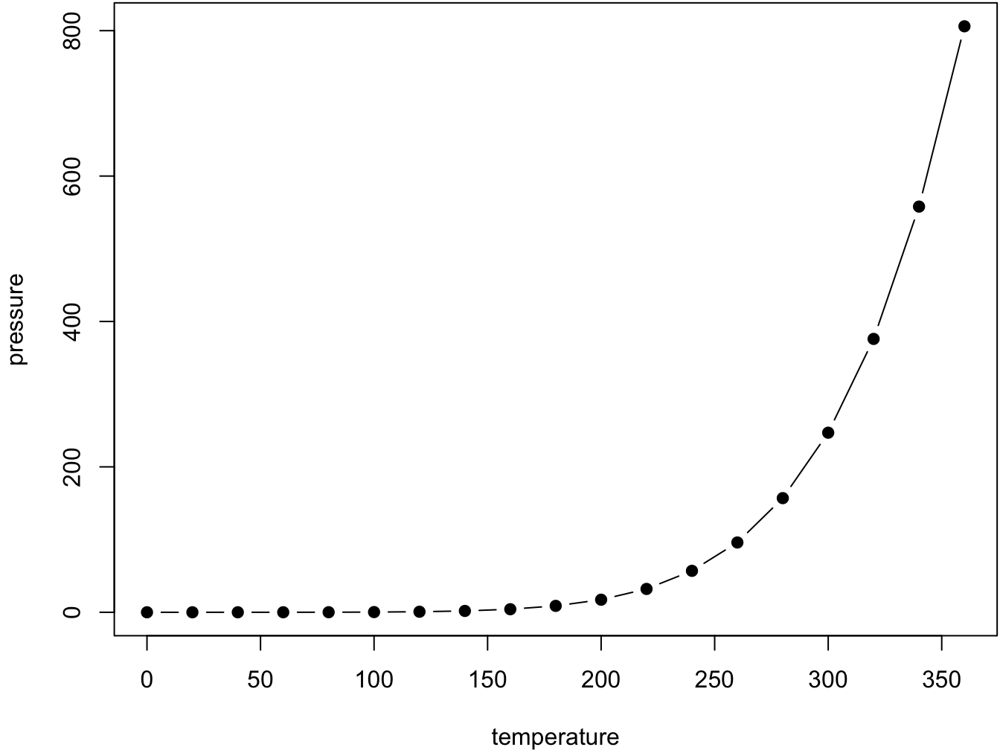
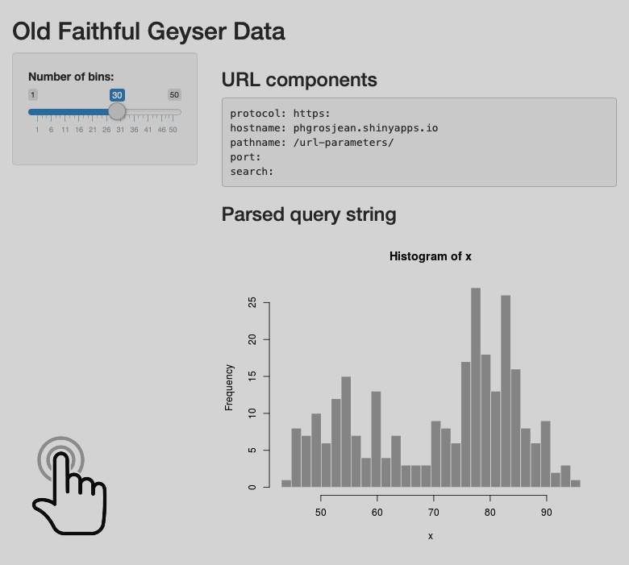
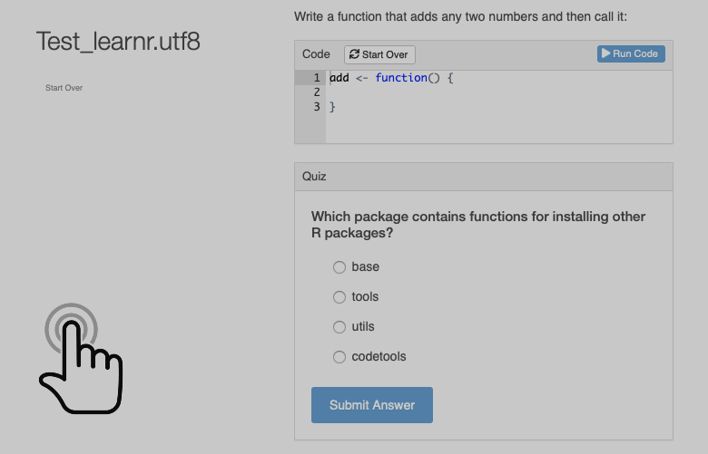

# (PART) Course I: test {-}

# Introduction {#intro}


This is a bookdown chapter mostly for demonstration and testing ... I started from [here](http://seankross.com/2016/11/17/How-to-Start-a-Bookdown-Book.html), then got some pieces from [here](https://github.com/rstudio/bookdown-demo), and finally skimmed the [bookdown book](https://bookdown.org/yihui/bookdown/) and took some notes hereunder. I had also a look at this [blog](http://seankross.com/2016/11/17/How-to-Start-a-Bookdown-Book.html).

[SciViews](http://www.sciviews.org)

~~To convince *someone* to switch to Markdown, show him [this](http://nerdplusart.com/markdown-is-the-future/). A short discussion of html/active documents _versus_ pdf/static printable pages should be nice here.~~

*Now, let's look at special formattings provided by bookdown.*


## Book-wide references

With R Markdown, it is only possible to reference items inside the same document, and there is no numbered figures, tables or equations (at least if LaTeX code is not used, but then, you can olny generate a PDF). Bookdown fills the gap with new formatting instructions that work across all documents of the book. It also provides updated versions of R MArkdown output formats that support numbered figures, tables and equations, e.g., `html_document2` to replace `html_document`, for instance.


### Reference to chapter and titles

You can reference **chapters** and **titles** using \@ref(intro). The book is organized in chapters and all numbers are by chapters. However, there are special level 1 title you can use:

- **Parts**: use `# (PART) Part I {-}` just before the first title of that part. 

- **Appendix**: use `# (APPENDIX) Appendix {-}` just before appendices titles. They will be numbered separately.


### Numbered figures and tables

**Figures** and **tables** are in their own environments:


```r
par(mar = c(4, 4, .1, .1))
plot(pressure, type = 'b', pch = 19)
```

<div class="figure" style="text-align: center">

<p class="caption">(\#fig:nice-fig)Here is a nice figure!</p>
</div>

Reference a figure by its code chunk label with the `fig:` prefix, e.g., see Figure \@ref(fig:nice-fig). Similarly, you can reference tables generated from `knitr::kable()`, e.g., see Table \@ref(tab:nice-tab).


```r
knitr::kable(
  head(iris, 20), caption = 'Here is a nice table!',
  booktabs = TRUE
)
```


Table: (\#tab:nice-tab)Here is a nice table!

 Sepal.Length   Sepal.Width   Petal.Length   Petal.Width  Species 
-------------  ------------  -------------  ------------  --------
          5.1           3.5            1.4           0.2  setosa  
          4.9           3.0            1.4           0.2  setosa  
          4.7           3.2            1.3           0.2  setosa  
          4.6           3.1            1.5           0.2  setosa  
          5.0           3.6            1.4           0.2  setosa  
          5.4           3.9            1.7           0.4  setosa  
          4.6           3.4            1.4           0.3  setosa  
          5.0           3.4            1.5           0.2  setosa  
          4.4           2.9            1.4           0.2  setosa  
          4.9           3.1            1.5           0.1  setosa  
          5.4           3.7            1.5           0.2  setosa  
          4.8           3.4            1.6           0.2  setosa  
          4.8           3.0            1.4           0.1  setosa  
          4.3           3.0            1.1           0.1  setosa  
          5.8           4.0            1.2           0.2  setosa  
          5.7           4.4            1.5           0.4  setosa  
          5.4           3.9            1.3           0.4  setosa  
          5.1           3.5            1.4           0.3  setosa  
          5.7           3.8            1.7           0.3  setosa  
          5.1           3.8            1.5           0.3  setosa  


### Numbered equations

To number equations and allow to refer to them, use an `equation` environment and label them with the syntax `(\#eq:label)`:

\begin{equation} 
  f\left(k\right) = \binom{n}{k} p^k\left(1-p\right)^{n-k}
  (\#eq:binom)
\end{equation} 

... and here, I refer to eq. \@ref(eq:binom). In the vase equations are not labelled, use the `equation*` environment instead.


## Citations

You can reference citations, too. For example, we are using the **bookdown** package [@R-bookdown] in this sample book, which was built on top of R Markdown and **knitr** [@xie2015].


## Cache long computations

If some computation is time-consuming, we could consider to cache it:


```r
# A verrry long computation!
1 + 1
```

```
# [1] 2
```

## Contextual show/hide sections

In this example, two classes, `UMONS` and `noinstitution` allow to define sections that are displayed for UMONS students (when the book is launched from UMONS Moodle), or for the general public.

----

::: {class="UMONS"}

> **This content is _UMONS_-specific.**

:::

::: {class="noinstitution"}

This content is displayed when the document is loaded outside of UMONS Moodle.

It is also the default content on the web. So that one can provide viable alternatives to exercices outside of the UMONS context in a transparent way (no need any more to indicate "for UMONS students, do this, for the others, do that"). Distinction is made via the URL by detecting `?institution=UMONS`.

:::

----

Otherwise, for further details, one can use the`<details>...</details>` construct:

<details>
<summary>More details...</summary>
This is a section that provides further explanations.

There can be several paragraphs!

----
</details>

And this is again normal text...

## Shiny app

A shiny application directly inside the book using an iframe. This application demonstrates how an histogram changes when the number of classes is modified.



<iframe width="780" height="700" frameborder="0" scrolling="auto" style="display:none" class="shiny-app" id="app1"></iframe>
*Cliquez pour lancer ou exécutez `BioDataScience::runApp("url-parameters")` dans la svbox2019.*

## Learnr with one exercise and one quizz

A simple learnr document from `shinyapps.io`\ :


<iframe width="780" height="500" frameborder="0" scrolling="auto" style="display:none" class="shiny-app" id="app2"></iframe>
*Cliquez pour démarrer le learnr ou exécutez `BioDataScience::run("sdd1-01b")` dans la svbox2019.*

## A Coggle mind map

<iframe width='780' height='500' src='https://embed.coggle.it/diagram/XmZC8uMesCWdXGt6/70b78931eae4a12991c10df0f7f2f49f498e58ad68cc66e3f82da43b57951f3e' frameborder='0' allowfullscreen></iframe>

## H5P content

H5P content can be displayed in iframes. Here is an example of a multiple choice widget:


<iframe src="https://wp.sciviews.org/wp-admin/admin-ajax.php?action=h5p_embed&id=7" width="780" height="270" frameborder="0" allowfullscreen="allowfullscreen" class="h5p"></iframe><script src="https://wp.sciviews.org/wp-content/plugins/h5p/h5p-php-library/js/h5p-resizer.js" charset="UTF-8"></script>

Here is a "drag words" widget:

<iframe src="https://wp.sciviews.org/wp-admin/admin-ajax.php?action=h5p_embed&id=6" width="780" height="270" frameborder="0" allowfullscreen="allowfullscreen" class="h5p"></iframe><script src="https://wp.sciviews.org/wp-content/plugins/h5p/h5p-php-library/js/h5p-resizer.js" charset="UTF-8"></script>

Here is a video widget:

<iframe src="https://wp.sciviews.org/wp-admin/admin-ajax.php?action=h5p_embed&id=8" width="780" height="500" frameborder="0" allowfullscreen="allowfullscreen" class="h5p"></iframe><script src="https://wp.sciviews.org/wp-content/plugins/h5p/h5p-php-library/js/h5p-resizer.js" charset="UTF-8"></script>

Some text...

## Try to add Moodle content

<iframe src="https://moodle.umons.ac.be/mod/quiz/attempt.php?attempt=212622&cmid=116372" width="780" height="270" frameborder="0"></iframe>


## Add a Gist

<script src="https://gist.github.com/GuyliannEngels/e349f835d11ec3f585bd27c0daa47012.js"></script>

and for an R markdown document:

<script src="https://gist.github.com/GuyliannEngels/dea087d0bd2321a2ae896211bdc6b4b8.js"></script>


## Embed a youtube video

<iframe width="770" height="433" src="http://www.youtube.com/embed/yIVXjl4SwVo?rel=0" frameborder="0" allowfullscreen></iframe>


## Special blocks

<div class="note">
<p>This is a <strong>note</strong>.</p>
</div>

<div class="info">
<p>This is an <strong>information</strong>.</p>
</div>

<div class="warning">
<p>This is a <strong>warning</strong>.</p>
</div>

<div class="error">
<p>This block can be used in case of <strong>error</strong>.</p>
</div>

<div class="win">
<p>This is related to <strong>Windows</strong>.</p>
</div>

<div class="mac">
<p>This is related to <strong>MacOS</strong>.</p>
</div>

<div class="linux">
<p>This is related to <strong>Linux</strong>.</p>
</div>

<div class="bdd">
<p>This is related to the <code>BioDataScience</code> package.</p>
</div>

\BeginKnitrBlock{sv}<div class="sv">This is a `block2` construct related to `SciViews` or `SciViews::R`:

- item 1
- item 2
- item 3
</div>\EndKnitrBlock{sv}

<div class="svbox">
<p>This is a section related to the <strong>SciViews Box</strong>…</p>
</div>


**TODO:** browse the bookdown book from 2.4 Figures on....
