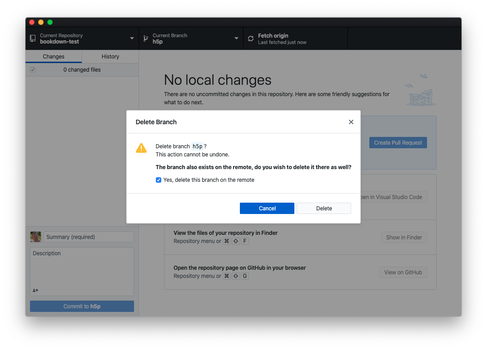

# Git & GitHub {#git}


Nous utilisons abondamment et enseignons l'usage de git et GitHub dans le cadre de nos cours de **Science des Données Biologiques** à l'UMONS. De plus, nous utilisons GitHub Classroom pour gérer la distribution des travaux aux étudiants sous forme de dépôts GitHub. Cette section couvre ces logiciels.

## Installation Git et cie

Dans la SciViews Box, git, GitHub Desktop et RStudio server (incluant une interface vers git) sont préinstallés. Hors machine virtuelle, il faut installer git, [RStudio](https://rstudio.com/products/rstudio/download/#download) et [GitHub Desktop](https://desktop.github.com/). Le reste se fait en interagissant avec GitHub via le navigateur web.

## BioDataScience-Course

L'organisation GitHub [BioDataScience-Course](https://github.com/BioDataScience-Course) regroupe tous les dépôts relatifs à nos cours, y compris les travaux des étudiants.

### Convention de noms

Comme l'organisation contient plusieurs milliers de dépôts, il est utile de les nommer correctement pour s'y retrouver. Les dépôts créés via GitHub Classroom seront traités plus loin. Voici quelques règles\ :

- Les dépôts important (matériel pédagogique, gestion des étudiants et de leur progression, ...) commencent tous par `sdd` lorsque ces dépôts sont utilisés en interne (ex.\ : `sdd_lesson`, `sdd_movies`, `sdd-admin`, ...). **Attention\ : `sdd` est suivi d'un trait souligné (`sdd_`) pour les dépôts classiques comme par exemple `sdd_lesson`, mais d'un tiret (`sdd-`) pour les bookdowns comme par exemple `sdd-umons-2020`. Cette distinction est importante pour éviter de mélanger ces deux types de dépôts.

- Les dépôt concernant des items publics peuvent aussi utiliser `BioDataScience` comme préfixe pour être plus explicite (ex.\ : `BioDataScience1`, `BioDataScienceData`, `BioDataScienceExam`, ...). Pour les dépôts moins importants ou de test, utiliser un autre préfixe.

- Lorsqu'un dépôt est relatif à une cohorte d'étudiants en particulier, nous l'indiquons par un suffixe reprenant les deux derniers chiffres de l'année initiale, suivi de `m` pour les étudiants montois et `c` pour les étudiants de Charleroi. Par exemple, `sdd_students19m` concerne la cohorte d'étudiants montois inscrits en premier cours (Bab2 de biologie) en 2019-2020. De même `sdd_students20c` concerne la cohorte d'étudiants de Charleroi inscrits en Bab2 en 2020-2021.


## GitHub Classroom

Nous utilisons [GitHub Classroom](https://classroom.github.com/classrooms) pour gérer la distribution des travaux aux étudiants sous forme de dépôts GitHub. GitHub Classroom se lie à une organisation GitHub (dans notre cas, `BioDataScience-course`). Il permet de gérer différentes classes afin d'organiser les cohortes d'étudiants. Les conventions de noms sont similaire aux convention présentée précédemment. Par exemple, la classe `sdd1-19m` correspond au cours de Science des données biologiques I donné aux étudiants montois de l'année académique 2019-2020. **Commentaire PhG\ : ne devrait-on pas plutôt utiliser `sdd_19m` pour mieux respecter les conventions ci-dessus\ ? Mais problèmes avec le sous-tiret dans GitHub Classroom\ ?**

Au sein de chaque classe, il est possible de créer des exercices individuels ou par groupe que l'on nomme des assignations (*assignments* en anglais). Chaque nom d'assignation débute par le code lié à la classe. Cette nomenclature permet une gestion simplifiée de l'organisation sur GitHub. Par exemple, l'assignation `sdd2-20m-mod8` porte sur un exercice ciblé sur le module 8 du cours de science des données biologiques 2 pour les étudiants montois suivant ce cours durant l'année académique 2020-2021. Si le dépôt est complexe et porte sur plusieurs modules, il porte un nom lié au travail comme `sdd2-20m-biometry`.

Les exercices peuvent se baser sur un dépôt modèle (*template* en anglais) afin de guider les étudiants. Nous fournissons toujours un dépôt template pour nos exercices. Un dépôt template est un dépôt GitHub reconnu comme *Template repository* (ce paramètre est sélectionnable dans la configuration du dépôt).

Parmi les paramètres de l'exercice, il est important de spécifier si le dépôt est privé ou public. Par défaut, les dépôts reprenant les exercices des étudiants sont privés, mais chaque étudiant est libre de basculer n'importe lequel de ses dépôt en public afin d'offrir une visibilité à ce qu'il a réalisé dans R (peut être important en matériel complémentaire à un C.V. pour des profils plus typés science de données).

Un lien URL est fourni pour chaque exercice afin d'inviter les étudiants à rejoindre l'exercice. Pour les exercices individuels, GitHub Classroom va créer un dépôt généré à partir du dépôt template dans l'organisation `BioDataScience-Course` portant le nom de l'exercice suivi du nom d'utilisateur GitHub de l'étudiant (par exemple, `sdd2-20m-mod8-GuyliannEngels`). Les travaux de groupe portent le nom de l'exercice suivi du nom du groupe.

GitHub Classroom est en évolution constante. De nouvelles fonctionnalités apparaissent régulièrement afin d'améliorer la gestion des classes et des exercices. Par exemple l'[intégration de GitHub Classroom avec Moodle](https://classroom.github.com/help/setup-moodle) est en cours de développement. GitHub Classroom propose également l'application [GitHub Classroom Assistant](https://classroom.github.com/assistant) afin de télécharger l'ensemble des dépôts lié à un exercice dans un dossier de notre choix. Bien pratique pour les enseignants au moment d'évaluer les travaux des étudiants.

\BeginKnitrBlock{note}<div class="note">Une autre ressource intéressante dans le contexte de l'utilisation de GitHub/GitHub Classroom pour l'enseignement est [GitHub Education](https://education.github.com).</div>\EndKnitrBlock{note}

## Astuces Git et GitHub

Quelques astuces qui nous sont utiles...

- Comparaison de branches sur GitHub\ : ajouter `/compare` à la fin de l'URL du dépôt et une page de comparaison de branche apparait. Sinon, cette comparaison est aussi possible dans GitHub Desktop (menu `Branch -> Compare to Branch`).

- Lorsqu'une branche n'est plus utile, elle peut être facilement éliminée depuis GitHub Desktop (entrée de menu `Branch -> Delete...`). Cette branche doit être activée d'abord, et tous les commits doivent avoir été pushés. Il est conseillé d'éliminer la branche sur le serveur en même temps que la branche locale.



- Changement de gestion de dépôts GitHub suite à l'impossibilité d'utiliser le login et mot de passe depuis septembre 2021. Lancer le shell git et ensuite\ :

```
git remote -v
# Si on a quelque chose comme: origin https://github.com/org/repo.git c'est pas bon
# faire:
git remote set-url origin git@github.com:org/repo.git
```

- Il est utile d'enregistrer le matériel pédagogique tel qu'il se présente chaque année, d'une part à des fins d'archivage, et d'autre part afin que plus tard les étudiants puissent éventuellement retrouver ce matériel tel qu'il était lorsqu'il a suivi le cours. Différentes stratégies sont possibles\ : utilisation de branches, de releases, ... Cependant pour les bookdowns il n'est possible de présenter le site correspondant que de la dernière version pour un dépôt GitHub donné. Dans ce cas, il est plus intéressant d'archiver le bookdown relatif à une année académique sous forme d'un dépôt séparé, permettant ainsi d'accéder au site web correspondant depuis GitHub Pages. Pour cela, il ne faut pas forker le dépôt, mais en faire une copie miroir. La procédure pour réaliser cela est expliquée [ici](https://docs.github.com/en/github/creating-cloning-and-archiving-repositories/duplicating-a-repository). En pratique, nous ajoutons l'année de chaque version au nom du dépôt (par exemple, `sdd-umons-2018`, `sdd-umons-2019`, ...). La version correspondant à l'année académique 2018-2019 est `sdd-umons-2018` et c'est aussi la version de la SciViews Box associée, la svbox2018. Ensuite, il faut bien entendu éditer le dépôt ainsi copié en miroir pour indiquer dans le préambule que c'est une ancienne version, et aussi remplacer les liens vers des assignations GitHub Classroom obsolètes vers des suggestions de forker les dépôts templates correspondants afin que les anciens exercices puissent toujours être accédés, mais cette fois-ci, en dehors du contexte de GitHub Classroom.

\BeginKnitrBlock{warning}<div class="warning">
A partir de l'année académique 2020-2021, le dépôt de travail, ainsi que le lien sur le site web https://wp.sciviews.org comportent directement le renseignement de l'année. Ainsi, les modifications nécessaires sont minimales pour archiver le bookdown et la copie en mirior se fait vers le nouveau nom en début d'année.
</div>\EndKnitrBlock{warning}
