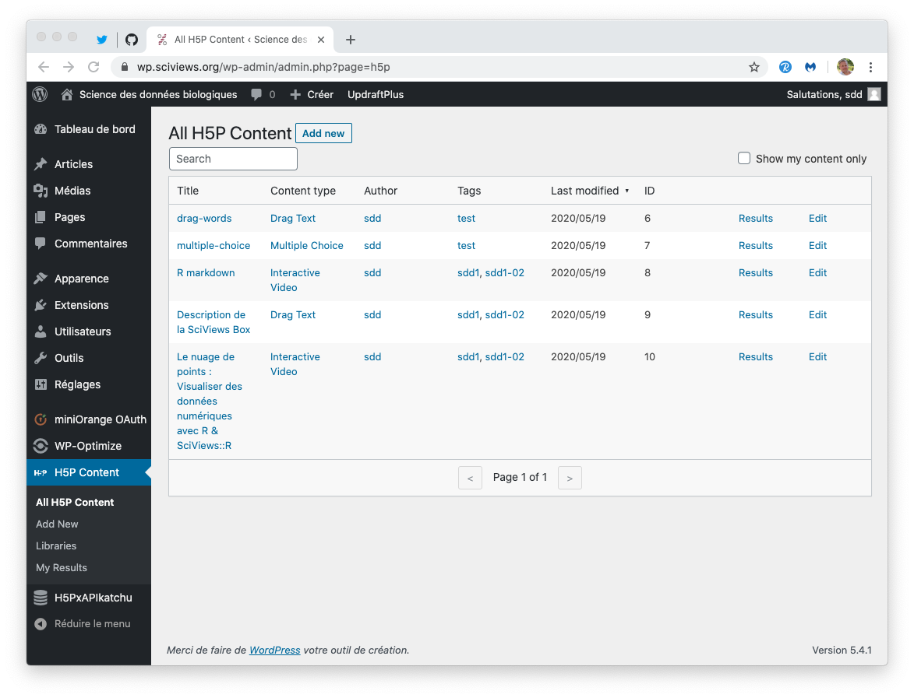

# Wordpress {#wordpress}


Nous utilisons [Wordpress](https://wordpress.org) principalement pour gérer nos widgets **h5p**. Cependant, étant basé sur un serveur LAMP (Linux-Apache-MySQL-PHP), il permet également de réaliser des fonctions basées sur des scripts côté serveur qui seraient difficiles, voire impossibles avec un site statique tel que l'offre bookdown, par exemple. Ainsi, nous pouvons aussi y intégrer un enregistrement de l'utilisateur via Github (protocole OAuth2). Ceci est bien pratique pour faire le lien entre le compte UMONS/Moodle et le compte Github de l'étudiant.

En effet, en 2018-2019 et 2019-2020, nous avons travaillé uniquement avec un serveur statique bookdown hébergé sur Github. Si le résultat est correct, nous avons noté plusieurs problèmes\ :

- Pas d'enregistrement des étudiants,
- Pas de h5p. Nous pourrions utiliser https://h5p.org, mais cette plateforme n'est prévue que pour des tests, et ne permet pas de récupérer les activités des étudiants,
- Pas de service d'applis Shiny et de learnrs. Nous exécutons ces applis en local dans la SciViews Box via les packages R [BioDataScience](https://github.com/BioDataScience-Course/BioDataScience) et [BioDataScience2](https://github.com/BioDataScience-Course/BioDataScience2). Cela permet d'utiliser les learnrs, mais sans être vraiment très pratique pour les étudiants. Les learnrs qui y sont intégrés se connectent à la base de données MongoDB via une petite appli Shiny intégrée qui demande le login Github de l'étudiant et son email pour l'identifier. Toutefois, comme aucun contrôle n'est fait sur ce qu'il entre dans ces champs, nous avons eu beaucoup d'enregistrements fantaisistes qu'il a fallu régler grâce à une table de corrections appliquée aux données de la base.

Au final, même si l'approche bookdown statique sur Github + learnr/Shiny en local dans la SciViews Box permet d'obtenir le minimum de fonctions requises pour le suivi de la progression d'apprentissage des étudiants, ce n'est pas pratique à l'usage et nous avons dû dépanner souvent des étudiants... sans compter leur stress de savoir si leur activité est bien enregistrée dans la base de données ou non (deux points sur vingt dans la note totale sont réservés à l'exécution de ces learnrs, d'où l'importance de bien enregistrer qui fait quoi).

Donc, en 2020-2021, nous avons décidé de mettre en œuvre un serveur Wordpress pour fournir des widgets h5p qui nous manquent et dont l'utilisation est enregistrée (protocole xAPI), et aussi pour nous permettre de mettre en œuvre une authentification des étudiants plus fiable. Notre objectif est double au niveau de l'authentification de nos étudiants. D'une part, nous voulons obtenir de manière fiable à la fois leurs données UMONS (via Moodle) et leurs données Github, ce qui implique que ces données doivent être soit fournies automatiquement, soit vérifiées durant l'authentification. D'autre part, nous voulons pouvoir exécuter des applications Shiny en mode sécurisé pour, par exemple, leur offrir un rapport de progression calculé en direct. La nouvelle authentification se fait comme suit\ :

1. Nous intégrons nos outils dans Moodle qui nous fournit alors l'authentification UMONS de l'étudiant. On obtient, entre autres, son numéro de matricule, son adresse email UMONS, son nom et son prénom, le cours qu'il suit, ... Les détails sont dans la section correspondante (voir \@ref(moodle)) et ne seront donc pas discutés ici.

2. Par ailleurs, nous utilisons abondamment Github pour les exercices des étudiants. Leur login y est différent, et il est aussi possible qu'ils y aient indiqué une adresse email différente (même si nous leurs demandons de mettre la même). Dans Wordpress, nous pouvons intégrer une authentification sur base de leur compte Github via le protocole OAuth2. C'est doublement intéressant car nous avons leur réel login Github à tous les coups, et aussi, nous sommes certains que leur compte Github est créé et actif dès le moment où ils sont enregistrés dans Wordpress. Que des avantages, donc. De plus, dans l'implémentation choisie, la connexion via Github montre clairement à l'étudiant s'il est connecté ou non.


Dès que l'étudiant s'est enregistré, les données utiles venant de Github sont rentrées dans la table des utilisateurs Wordpress. Nous pouvons donc combiner cette information avec les données provenant de Moodle pour établir un profil complet de l'étudiant dans notre site Wordpress automatiquement.

## Installation Wordpress

Notre nom de domaine `sciviews.org` est géré par https://gandi.net. Ce provider propose aussi un hébergement web Wordpress dans un serveur LAMP préconfiguré. Nous utilisons cette option pour l'instant en test. Le serveur utilise 1 cpu et 256Mo de RAM avec 20Go d'espace de stockage, et un quota de 300.000 pages vues par mois et 60Go par mois. Il est upgradable à tous niveau. Nous verrons comment il se comporte en charge avec nos étudiants et pourrons toujopurs passer vers un plan supérieur si des len teurs sont constatées. Le certificat SSL pour avoir une adresse sécurisée en `https://` est inclu dans le package.

Le serveur est installé initialement avec **PHP 7.3** et une base de données **MySQL 5.7** ne permettant que des requêtes locales. **Wordpress** est à la version **5.4.1**. Nous avons installé les extensions suivantes\ :

- **H5P 1.15.0**. Il faut installer les libraires séparément et les principales ont été rajoutées dès le départ. Les 5 ou 6 widgets H5P que nous avions déjà créés sont facilement importés en les exportant de leur site original au format `.h5p` en cliquant sur le bouton `reuse` en bas à gauche du widget. Ensuite dans Wordpress, on va dans le tableau de bord -> H5P Content, on clique `Add New` puis `Téléverser` et on sélectionne le ficher `.h5p`. Un backup de ces fichiers `.h5p` est également effectué sur p-cloud dans le dossier `sdd_h5p_backup`. Le plugin est ensuite configuré pour ne pas motrer la bannière h5p en bas des widgets et pour générer tous les événements xAPI possibles. 

- **SNORDIAN's H5PxAPIkatchu 0.4.2** capture les événements xAPI générés par H5P et les stockent directement dans la base de données MySQL liée à Wordpress. Il y a une interface simpliste pour visualiser les tables, les filtrer et explrter au format CSV. **Dans un premier cela nous servira, mais nous devrons développer une autre façon de récupérer les donner, voire, dériver un autre plugin pour envoyer les événements directement dans la même base de données MongoDB que celle utilisée par nos applis Shiny** (voir \@ref(shiny)).

- **OAuth Single Sign On - SSO (OAuth Client) 6.15.2** configuré pour enregistrer et connecter un utilisateur via son compte Github. Pour permettre ceci une application Github nommée **BioDataScience** a été créée. La configuration de ce plugin est disponible depuis le tableau de bord de Wordpress -> miniOrange -> OAuth.

- **Import Users from CSV 1.0.1** est un plugin permettant de créer des utilisateurs en batch depuis un fichier CSV. Nous pourrons ainsi exporter en bloc les données venant de Moodle et créer en avance les comptes Wordpress avec plein d'informations supplémentaires.

- **Advanced iFrame Pro 2020.3** permet d'insérer un iframe avec plein d'options\ : sécurisation, adaptation de la taille, passage de paramètres, réécriture d'URL, etc. Nous utilisons ce plugin pour intégrer les bookdown dans le site Wordpress, et ainsi conserver la bannière supérieure de notre site tout en affichant le bookdown.

- **Shortcode Variables 3.1.1** ajoute un shortcode `[sv slug='...']` permettant d'y placer du texte prédéfini ou une variable système comme le nom ou l'email de l'utilisateur actuel, voir aussi \@ref(var-context).

- **UpdraftPlus 1.16.24** comme système de backup de l'ensemble (fichiers Wordpress + base MySQL). Le backup se fait en local pour l'instant dans `lamp0/web/vhosts/wp.sciviews.org/htdocs/wp-content/updraft`, mais il est recopié sur notre disque p-cloud dans le dossier `sdd_site_backup`.

- Quelques autres plugins aidant à gére le site Wordpress\ : **Broken Link Checker 1.11.12**, **Health Check & Troubleshooting 1.4.4** & **WP-Optimize 3.0.19**.

Le site est servi à l'adresse https://wp.sciviews.org. Les enseignants y sont enregistrés comme éditeurs. En outre, un compte administrateur est aussi créé. Le serveur est accessible par SSH (après activation provisoire dans gandi) et sFTP. Toutes les informations nécessaires seront transmises aux intéressés par voie sécurisée.

### Login et enregistrement de la progression

Pour l'instant, le login dans le site Wordpress est réaliser via le compte Github de l'étudiant comme expliqué plus haut. Cela permet de récupérer des infos sur le compte Github comme le logiun, ou l'adresse mail primaire associé. Si la page principale est lancée depuis Moodle, nous injectons également des données issues de Moodle et donc, les infos UMONS de l'étudiant comme son nom, son email UMONS, son numéro de matricule, etc. De cette manière, nous arrivons à combiner toutes les infos qui nous sont nécessaire pour gérer correctement le compte de chaque étudiant et enregistrer sa progression.

Une fois le compte créé dans Wordpress, l'étudiant a la possibilité de modifier des informations, dont son adresse email. S'il le fait, cette adresse n'est alors plus synchrone avec celle de Github (**à tester**). C'est toutefois cette addresse email enregistrée dans Wordpress qui est employée pour enregistrer les activités h5p, et le sera aussi pour les learnr et les app Shiny dans une certaine mesure. En effet, pour ces derniers, le choix de l'identifiant est le suivant\ : (1) l'email du compte Wordpress (donc le même que Guthub initialement), (2) si vide, l'email UMONS, (3) si vide, le login Github. Si aucune des trois infos n'est disponible, nous n'enregistrons **pas** l'activité learnr et app Shiny, et l'outil de test en début de bookdown indique clairement que la navigation se fait de manière anonyme. Par contre, il me semble (à tester) que H5xAPIkatchu enregistre l'activité h5p sous un UUID créé à la volée. Même si c'est le cas, nous pouvons toujours filtrer et éliminer ces données-là plus tard.

Par ailleurs, il est possible d'enregistrer les événements principaux h5p (soumission des exercices) dans Wordpress directement. Je pense (à vérifier) que cette fonction est associée à l'enregistrement d'état des contenus h5p d'une session à l'autre. Cette info est redondante avec H5PxAPIkatchu, mais elle est utile car l'étudiant a accès à h5p en lecture seule dans le tableau de bord, et il peut y lire les détails de sa progression dans l'ensemble des exercices h5p de tous les cours, s'il le souhaite (voir capture d'écran). Reste à déterminer l'occupation disque de cette fonction\ !


Comme nous pouvons le voir, le tableau de bord de l'étudiant est réduit au minimum. En plus de la partie "H5P Content" où il peut voir et filtrer la liste des applis H5P et voir ses propres résultats H5P, il a accès à son profil où il peut modifier des données utilisées par nos outils comme `displayname`, `email`, `firstname`, `lastname`. Il ne peut pas modifier son login (alias "identifiant" dans Wordpress). De plus, comme nous croisons avec les données UMONS issues de Moodle, nous aurons toujours à disposition des informations permettant d'identifier les étudiants. Par contre, je crois que la possibilité de modifier ces informations par l'étudiant (utilisateur) lui-même fait partie des contraintes RGPD pour lesquelles Wordpress assure la compatibilité.

### Intégration des bookdowns dans le site

Pour l'instant, il y a deux versions\ :

- Science des données biologiques 1 renvoie vers le bookdown de test directement. A partir de ce moment, nous perdons le contrôle et c'est le bookdown qui doit tout gérer... or comme c'est une page statique, les possibilités sont limitées à du JavaScript qu'on aurait été y mettre,

- Science des données biologiques 3 revoie à la même page, **mais intégrées sous forme d'iframe** dans une page de Wordpress dédiée. Nous utilisons le plugin *Advanced iFrame* qui permet de contrôler la taille de l'iframe, de lui passer des paramètres et encore d'autres choses. Cela donne pas mal, et l'utilisateur conserve la barre d'outils supérieure (accès à Moodle, Discord, etc.) S'il veut lire le contenu du bookdown sans voir cette barre, il lui suffit de faire coulisser la page jusque tout en bas et la barre de menu du site sera cachée.

### Intégration des h5p dans bookdown

H5p s'affiche dans un iframe dans le document principal. Il lui transmet les événements xAPI, et c'est donc ce document principal qui doit les traiter. Nous avons ici une impossibilité à le faire si nous sommes dans un cas où h5p est servi par un serveur différent que notre bookdown. En effet, les accès en "Cross-Origin Resource Sharing" ou CORS sont restreintes pour éviter des attaques de site évidentes. Ainsi un iframe issu d'un serveur différent de la page qui l'héberge ne peut communiquer librement avec la page qui le contien si elle provient d'un site différent. Or, nous avons besoin de cette communication pour transmettre les événements xAPI de h5p.

La solution que nous avons trouvée est d'ajouter le dossier qui contient nos pages statiques du bookdown à Wordpress directement. Ainsi les deux sont maintenanrt servis à partir de la même adresse https://wp.sciviews.org. Pour l'instant, nous copions simplement ces fichiers dans un sous dossier `sdd-umons` dans `lamp0/web/vhosts/wp.sciviews.org/htdocs`. Ainsi, le bookdown en question est servi par Wordpress à l'adresse https://wp.sciviews.org/sdd-umons. Et à présent, la communication des xAPI h5p est possible... à condition d'ajouter le code nécessaire dans bookdown.

Nous créons un fichier `header.html` dans bookdown qui contient ce code, extrait du serveur Wordpress, puisque nous sommes dedans maintenant. Il suffit alors de le reseigner dans l'entête YAML du fichier principal `index.Rmd` comme\ :

```
includes:
  in_header: header.html
```

et le tour est joué. Il nous faut maintenant inclure facilement les widgets h5p depusi Wordpress dans nos pages bookdown. Ces widgets sont identifiés par un numéro (ID) dans Wordpress.



Nous devons créer un iframe dans la page bookdown, mais nous pouvons déléguer ce travail à une fonction R\ :


```r
h5p <- function(id, width = 780, height = 500) {
  glue::glue("\n<iframe src=\"https://wp.sciviews.org/wp-admin/admin-ajax.php?action=h5p_embed&id={id}\" width=\"{width}\" height=\"{height}\" frameborder=\"0\" allowfullscreen=\"allowfullscreen\" class=\"h5p\"></iframe><script src=\"https://wp.sciviews.org/wp-content/plugins/h5p/h5p-php-library/js/h5p-resizer.js\" charset=\"UTF-8\"></script>\n")
}
```

Ensuite, ajouter un widget h5p est aussi simple que d'ajouter `h5p(id)` dans du code R en ligne où "id" est l'ID tel que renseigné dans le tableau sous Wordpress. On peut aussi jouer sur les arguments `width=` et `height=` pour ajuster l'emplacement du widget h5p dans la page.

Ainsi programmé notre widget h5p se comporte comme suit\ :

- pour un utilisateur enregistré dans Wordpress, les événements xAPI sont enregistrés dans notre base de données MySQL. Nous pouvons donc suivre la progression de nos étudiants via les widgets h5p également, en plus des applis widgets et des learnrs. De plus, l'état d'achèvement de l'exercice est aussi enregistré pour un bon nombre de widgets et rétabli lorsque la page est rechargée par le même utilisateur.

- pour un utilisateur non enregistré, les widgets h5p fonctionnent normalement, mais aucun événement xAPI n'est enrgistré, et l'état de complétude de l'exercice n'est pas conservé non plus. Si la page est rechargée, les widgets h5p retournent à leur état initial à chaque fois.

Ceci est un inconfort mineur et permet l'utilisation des widgets h5p de manière optimale pour nos étudiants dûment enregistrés, tout en permettant une libre utilisation par d'autres visiteurs sans polluer notre base de données.

Nous avons également tenté de passer des arguments supplémentaires via l'URL qui lance la page bookdown, et qui les tranfèrent vers l'iframe h5p, mais sans succès car apparemment Worpress réécrit l'URL et laisse tomber ces arguments supplémentaires. C'est pas important si nous pouvons tracer nos utilisateurs via leur login (= login Github pour rappel).

### Création de contenu h5p

Tout éditeur Wordpress (les ensignants) peuvent créer du contenu nouveau h5p à partir du tableau de bord de Wordpress, et éditer les widgets existants. L'édition de manière quasi-wysiwyg avec les mêmes éditeurs que ceux disponibles sur https://h5p.org. C'est donc très facile. Il faudrait juste se discipliner à faire des backups via les fichiers .h5p sur p-Cloud dans `sdd_h5p_backup` par sécurité.

TODO: il serait utile de pouvoir sortir une table de correspondance entre l'ID du widget h5p et un nom plus explicite. En effet, seul l'ID apparait dans l'événement xAPI.

### Gestion des événements xAPI

Ces événements sont accessibles à partir du tableau de bord de Wordpress dans la section H5PxAPIkatchu.


Cette interface est basique, mais elle n'est pas prévue pour se substituer à des outils plus évolués. TODO: nous devons voir comment récupérer ces évémnements facilement et les injecter dans notre base de données MongoDB, à côté des événements learnr et Shiny. Pour rappel, la base de données MySQL n'est **pas** accessible depuis l'extérieur pour des raisons de sécurité et l'accès SSH doit être réactivé manuellement pour une courte durée.

### Variables contextuelles {#var-context}

Pour le bon fonctionnement de nos outils et l'enregistrement de l'activité des étudiants, nous avons besoin de définir un certain nombre de variables reprises dans le tableau ci-dessous. Toutes ces variables sont obtenues directement à la source^[En 2018-2019 et 2019-2020, nous utilisions le login Github et l'adresse email UMONS pour identifier les événements learnr, mais comme les étudiants devaient rentrer ces infos manuellement, nous avons eu beaucoup de soucis avec des encodages erronés... Donc maintenant, nous récupérons ces infos de manière automatique à la source autant que possible.]. La colonne origine indique d'où nous obtenons ces informations (pour Moodle, il faut que l'étudiant ait lancé https://wp.sciviews.org depuis son compte Moodle et à partir de la page de cours correspondante).

| Variable      | Contenu                            | Origine      |
|:--------------|:-----------------------------------|:-------------|
| login         | Le login Github de l'étudiant      | WP via Github `[sv slug='sc-username']` |
| email         | Le mail primaire Github de l'étudiant | WP via Github `[sv slug='sc-user-email']` |
| displayname   | Nom utilisateur Wordpress(/Github)    | WP `[sv slug='sc-display-name']` |
| firstname     | Prénom comme indiqué dans Wordpress | WP via Github `[sv slug='sc-first-name']` |
| lastname      | Nom de famille comme indiqué dans Wordpress | WP via Github `[sv slug='sc-last-name']` |
| iemail        | Le mail UMONS (institutionnel) de l'étudiant        | Moddle `iemail`= Adresse de courriel  |
| iid           | Numéro de matricule de l'étudiant  | Moodle `register` = Nom d'utilisateur |
| ifirstname     | Prénom comme indiqué dans Moodle | Moodle `ifirstname` = Prénom |
| ilastname      | Nom de famille comme indiqué dans Moodle | Moodle `ilastname` = Nom |
| institution   | Institution (ici `UMONS`)   | Moodle `institution` = Institution |
| icourse       | Nom abbrégé du cours (ex.: `S-BIOG-006`)  | Moodle `icourse` = N° d'identification du cours |
| iurl          | URL du serveur institutionnel (Moodle)         | Moodle `iurl` = URL du serveur |
| iref          | Identifiant unique dans Moodle          | Moodle `iref` = Numéro d'identification |

A noter que nous croisons différentes sources (Moodle, Github, Wordpress), et les infos peuvent différer entre ces sources. Considérant un étudiant qui a "installé" ses outils correctement, à savoir\ :

- Son compte est créé au préalable dans Wordpress à partir du tableau des utilisateurs du cours issu de Moodle^[Il serait possible de proposer l'enregistrement libre, mais il faut acheter la version pro du plugin correspondant... et de plus, tout le monde ayant un compte Github pourrait alors s'enregistrer\ ! C'est pas ce qu'on souhaite.],
- Il a créé un compte Github,
- Il a au moins une fois lancé la page https://wp.sciviews.org depuis le lien Moodle `Bookdown` dans le bon cours,
- Il s'est connecté dans Wordpress à partir du bouton de login via Github/BioDataScience.

\BeginKnitrBlock{note}<div class="note">Faut-il *forcer* le login de l'étudiant dans Wordpress\ ? Autrement dit, il n'aurait accès aux cours que s'il est connecté. Il existe des plugins Wordpress qui permettent de faire cela, et aussi d'exclure les pages qui peuvent être vues par tous. Un de ces plugins est **[Force login](https://wordpress.org/plugins/wp-force-login/)**.</div>\EndKnitrBlock{note}

Toutes les informations de son compte lui sont accessibles dans Wordpress, et il peut librement les modifier dans le tableau de bord. Donc, cela signifie que l'information cruciale pour identifier un étudiant est `iemail`, son adresse email de l'UMONS fournie par Moodle. Toutefois, nous devons recouper avec son `login` Github pour obtenir les données issues de Github pour le même étudiant. Nous avons éventuellement besoin aussi de `email`, son email Github primaire (mais vérifier si celui-ci est enregistré dans Wordpress si l'étudiant est pré-enregistré via le tableau Moodle\ ! A moins que l'enregistrement ne puisse se faire *que* si les deux emails sont identiques\ ?)

Si nous continuons à utiliser Discord, ce serait bien d'avoir le login Discord de l'étudiant aussi. Mais ici, il a le droit d'y poser des questions de manière anonymisée (c'est notre souhait). Néanmoins, il serait utile d'avoir un champ où nous pouvons éventuellement rentrer cette info à la main si souhaité. Une autre colonne `comment` serait aussi utile. Nous pourrions y indiquer par exemple si un étudiant a des difficultés particulières, ou la date de son arrivée pour les étudiants étrangers en passerelle, par exemple.


