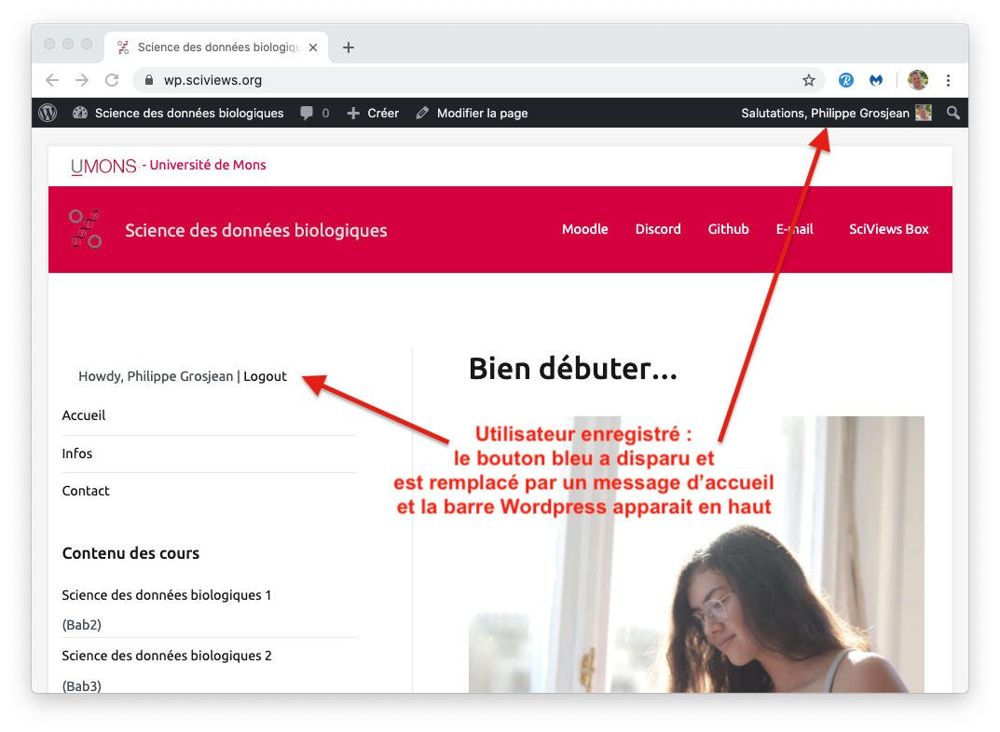

# Wordpress {#wordpress}

Nous utilisons [Wordpress](https://wordpress.org) principalement pour gérer nos widgets **h5p**. Cependant, étant basé sur un serveur LAMP (Linux-Apache-MySQL-PHP), il permet également de réaliser des fonctions basées sur des scripts côté serveur qui seraient difficiles, voire impossibles avec un site statique tel que l'offre bookdown, par exemple. Ainsi, nous pouvons aussi y intégrer un enregistrement de l'utilisateur via Github (protocole OAuth2). Ceci est bien pratique pour faire le lien entre le compte UMONS/Moodle et le compte Github de l'étudiant.

En effet, en 2018-2019 et 2019-2020, nous avons travaillé uniquement avec un serveur statique bookdown hébergé sur Github. Si le résultat est correct, nous avons noté plusieurs problèmes\ :

- Pas d'enregistrement des étudiants,
- Pas de h5p. Nous pourrions utiliser https://h5p.org, mais cette plateforme n'est prévue que pour des tests, et ne permet pas de récupérer les activités des étudiants,
- Pas de service d'applis Shiny et de learnrs. Nous exécutons ces applis en local dans la SciViews Box via les packages R [BioDataScience](https://github.com/BioDataScience-Course/BioDataScience) et [BioDataScience2](https://github.com/BioDataScience-Course/BioDataScience2). Cela permet d'utiliser les learnrs, mais sans être vraiment très pratique pour les étudiants. Les learnrs qui y sont intégrés se connectent à la base de données MongoDB via une petite appli Shiny intégrée qui demande le login Github de l'étudiant et son email pour l'identifier. Toutefois, comme aucun contrôle n'est fait sur ce qu'il entre dans ces champs, nous avons eu beaucoup d'enregistrements fantaisistes qu'il a fallu régler grâce à une table de corrections appliquée aux données de la base.

Au final, même si l'approche bookdown statique sur Github + learnr/Shiny en local dans la SciViews Box permet d'obtenir le minimum de fonctions requises pour le suivi de la progression d'apprentissage des étudiants, ce n'est pas pratique à l'usage et nous avons dû dépanner souvent des étudiants... sans compter leur stress de savoir si leur activité est bien enregistrée dans la base de données ou non.

Donc, en 2020-2021, nous avons décidé de mettre en œuvre un serveur Wordpress pour fournir des widgets h5p qui nous manquent et dont l'utilisation est enregistrée (protocole xAPI), et aussi pour nous permettre de mettre en œuvre une authentification des étudiants plus fiable. Notre objectif est double au niveau de l'authentification de nos étudiants. D'une part, nous voulons obtenir de manière fiable à la fois leurs données UMONS (via Moodle) et leurs données Github, ce qui implique que ces données doivent être soit fournies automatiquement, soit vérifiées durant l'authentification. D'autre part, nous voulons pouvoir exécuter des applications Shiny en mode sécurisé pour, par exemple, leur offrir un rapport de progression calculé en direct. La nouvelle authentification se fait comme suit\ :

1. Nous intégrons nos outils dans Moodle qui nous fournit alors l'authentification UMONS de l'étudiant. On obtient, entre autres, son numéro de matricule, son adresse email UMONS, son nom et son prénom, le cours qu'il suit, ... Les détails sont dans la section correspondante (voir \@ref(moodle)) et ne seront donc pas discutés ici.

2. Par ailleurs, nous utilisons abondamment Github pour les exercices des étudiants. Leur login y est différent, et il est aussi possible qu'ils y aient indiqué une adresse email différente (même si nous leurs demandons de mettre la même). Dans Wordpress, nous pouvons intégrer une authentification sur base de leur compte Github via le protocole OAuth2. C'est doublement intéressant car nous avons leur réel login Github à tous les coups, et aussi, nous sommes certains que leur compte Github est créé et actif dès le moment où ils sont enregistrés dans Wordpress. Que des avantages, donc. De plus, l'enregistrement avec le plugin enregistré montre clairement à l'étudiant s'il est connecté ou non.

Dès que l'étudiant s'est enregistré, les données utiles venant de Github sont rentrées dans la table des utilisateurs Wordpress. Nous pouvons donc combiner cette information avec les données provenant de Moodle pour établir un profil complet de l'étudiant dans notre site Wordpress automatiquement.
