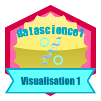

# Moodle {#moodle}

...TODO: expliquer les URLs spécialisées à ajouter dans les cours pour pouvoir récupérer les informations institutionnelles des étudiqnts et pour lier notre contenu pédagogique du mieux possible à l'espace Moodle qui y est consacré.

## Gestion des cours

Un espace différent a été créé pour chaque AA (donc, deux pour SDD I et SDD II) par l'administrateur Moodle. Voici la liste des AA, l'intitutlé et le code Moodle correspondant (qui ne correspond **pas** au code dans le programme des cours)\ :

| Cours               | Code Moodle  | Intitulé                                   |
|:--------------------|:-------------|:-------------------------------------------|
| SDD I Q1            | S-BIOG-006   | Science des données I : visualisation      |
| SDD I Q2            | (S-BIOG-027) | Science des données I : inférence (pas créé, utilisation de l'espace S-BIOG-006 pour les deux AA)          |
| SDD II Q1           | S-BIOG-015   | Science des données II : modélisation      |
| SDD II Q2           | (S-BIOG-061) | Science des données II : analyse  (pas créé, utilisation de l'espace S-BIOG-015 pour les deux AA)          |
| SDD III Q1          | S-BIOG-025   | Science des données III : exploration et prédiction  |
| SDD IV all          | S-BIOG-043   | Science des données IV : pratique          |
| SDD V Q1            | S-BIOG-077   | Science des données V : recherche reproductible  |
| SDD I Charleroi     | S-BIOG-921   | Bio-informatique et science des données    |
| SDD II Charleroi    | S-BIOG-937-  | Bio-informatique et science des données II |

## Badges

Les badges sont très utiles car ils matérialisent la progression des étudiants. C'est à la fois une façon ludique d'apprendre, et un moyen efficace de pousser un étudiant à travailler. Les badges sont générés dans Moodle, mais bien sûr, ils sont liés à des .... activités Moodle. Avec nos applications externes, nous ne pouvons fournir des badges que manuellement, ce qui devient très vite laborieux. **TODO:** trouver un moyen d'automatiser l'octroi de badges. Moodle peut se connecter à https://badgr.io, et nous pouvons peut-être travailler via son interface\ ? A creuser\ !

Pour créer des badges, nous pouvons utiliser une [application en ligne](https://www.openbadges.me/designer.html). Il suffit d'indiquer son adresse email, et de concevoir son badge. La même interface peut d'ailleurs être utilisée pour concevoir visuellement des hex-stickers (à faible résolution toutefois puisque c'est des fichiers .png de 200x200 pixels). Voici un exemple de badge que nous pourrions utiliser dans nos cours\ :

Les images correspondant à nos différents badges sont sur p-Cloud, dans le sous-dossier `sdd_badges`.

## Notes

**TODO:** il est possible d'envoyer les notes à Moodle via une URL qui renvoie un fichier XML... Explorer cette piste pour créer et mettre à jour les notes Moodle depuis nos applis...
